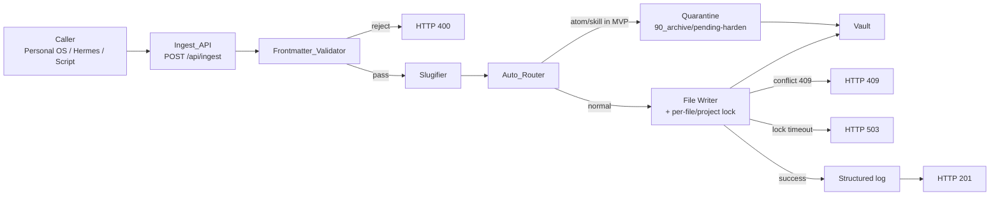

# Design Document — wiki-vault-restructure

本设计承接 `requirements.md`，给出 Wiki 重构特性的实现蓝图。所有章节都对照
requirements 编号引用（如 R2 AC5）。设计严格遵循 PRODUCT_MAP 中
**7 天 MVP + 7 天 Harden** 的节奏，不做过度设计。

## 1. 架构总览

所有写入收口到 `Ingest_API`，经过统一管线后落盘：



MVP 与 Harden 的差异：

| 模块 | MVP | Harden |
|---|---|---|
| Frontmatter_Validator | 字段完整性 + 取值合法 + tag 大小写折叠 | 加上 tag-registry 校验 + tag 正则 |
| Auto_Router | project / journal / source 完整路由；atom / skill 进 quarantine | atom / skill 走 `20_atoms` / `50_skills`；quarantine 内容回流 |
| Migration_Script | — | 完整实现，含 dry-run / apply / 续跑 |
| MOC_Generator | — | 完整实现 |
| Tag_Registry | 仅大小写折叠（R10 AC5） | 完整 registry |
| Source 只读检查 | 写前 exists 校验 | 加上启动期+定时哈希校验 |
| Backward Compatibility | 旧目录原样读取 | 迁移完成后旧目录清空但保留 git 历史 |

---

## 2. Vault 目录规范

### 目标结构

```
vault/
├── 00_meta/                  [Harden] 索引、tag 字典、结构说明
│   ├── index.md              MOC 自动生成
│   ├── tags.md               tag registry
│   ├── structure.md          目录规范说明
│   └── migration-report.md   迁移产生的报表
├── 10_sources/               [MVP] 原始素材，只增不改（R7）
│   └── <YYYY-MM-DD>/<slug>.md
├── 20_atoms/                 [Harden] 原子笔记
│   └── <slug>.md
├── 30_projects/              [MVP] 项目档案
│   └── <project_slug>/
│       ├── README.md         自动建桩
│       └── <slug>.md
├── 40_journals/              [MVP] 每日日志
│   └── <YYYY-MM-DD>.md
│   └── <YYYY-MM-DD>-2.md     超大滚动（R6 AC6）
├── 50_skills/                [Harden] 可复用作业手册
├── 90_archive/
│   ├── pending-harden/       [MVP] atom/skill 暂存（R4 AC10）
│   │   ├── atom/
│   │   └── skill/
│   ├── needs-review/         [Harden] 迁移分类置信度低的文件
│   └── ...                   原有归档保留
└── (旧目录在迁移前原样保留：20_notes/、Personal OS Inbox/、Personal Wiki Mirror/)
```

### 命名约定示例

| type | 路径示例 |
|---|---|
| `source` | `10_sources/2026-05-11/article-tokyo-transit.md` |
| `project` | `30_projects/2026-05-东京行/行程.md` |
| `project README` | `30_projects/2026-05-东京行/README.md` |
| `journal` | `40_journals/2026-05-11.md` |
| `journal rolled` | `40_journals/2026-05-11-2.md` |
| `atom` (Harden) | `20_atoms/东京-交通.md` |
| `atom` (MVP quarantine) | `90_archive/pending-harden/atom/东京-交通.md` |
| `skill` (Harden) | `50_skills/旅游规划.md` |

---

## 3. Frontmatter Schema

### 字段定义

```yaml
---
title: string                         # 必填
type: atom | project | journal | skill | source  # 必填
created_by: user | hermes:intake | hermes:dispatcher | hermes:worker  # 必填
agent_id: string                      # 可选；非空字符串才合法
task_id: string                       # 当 created_by 以 hermes: 开头时必填
project: string                       # 当 type=project 时必填
source_type: user-note | article | transcript | agent-output  # 必填
tags: [string, ...]                   # 必填，可为空数组
created_at: ISO-8601 with timezone    # 必填；缺失时由服务端补当前时间
last_reviewed: ISO-8601               # 可选；用户手改后由 indexer 更新
migration: string                     # 可选；迁移脚本写入 legacy-<batch-id>
---
```

### 解析与序列化

- 使用 `python-frontmatter` 库读写 YAML 块。
  - ADR 2026-05-13：实际任务要求创建模块 `personal-wiki/api/frontmatter.py`，
    会遮蔽第三方包 `frontmatter` 的导入名。实现改用 `PyYAML` 做 YAML 块
    解析/序列化，保持对外 `parse()` / `serialize()` 行为不变。
- `created_at` 缺失 → 服务端补 `datetime.now(timezone.utc).isoformat()`。
- `created_at` 携带且无时区 → 拒绝，HTTP 400 `code=invalid-timestamp`。
- `tags`：去掉首字符 `#`，全部 `lower()`，去重保序。
- `title`、`project` 字符串 strip 两端空白。

### 校验失败到 HTTP 状态码的映射（R2/R3）

| 失败原因 | HTTP | code |
|---|---|---|
| YAML 解析失败 | 400 | `frontmatter-parse-error` |
| 必填字段缺失 | 400 | `frontmatter-missing-fields` |
| `type` 取值非法（含 `Atom`、`atoms`、`PROJECT` 等变体） | 400 | `invalid-type` |
| `created_by` 取值非法 | 400 | `invalid-created-by` |
| `created_by=hermes:*` 但 `task_id` 缺失 | 400 | `task-id-required-for-agent` |
| `type=project` 但 `project` 缺失 | 400 | `project-field-required` |
| `agent_id` 显式存在但为空字符串 | 400 | `agent-id-empty-string` |
| `source_type` 取值非法 | 400 | `invalid-source-type` |
| `created_at` 无时区 | 400 | `invalid-timestamp` |

### Round-trip 性质（P7）

服务端实现一对纯函数：

```python
def serialize(note: Note) -> str: ...
def parse(text: str) -> Note: ...
```

property test：对随机生成的合法 `Note`，断言
`parse(serialize(n)).frontmatter == n.frontmatter`，覆盖
Required + Conditional 全部字段。

---

## 4. Slugifier 算法

```python
import hashlib, re, unicodedata

CJK = r'\u4e00-\u9fff'
ALLOWED = re.compile(rf'[^A-Za-z0-9_\-{CJK}]')

def slugify(s: str) -> str:
    s = unicodedata.normalize('NFKC', s).strip()
    s = re.sub(r'\s+', '-', s)
    s = ALLOWED.sub('', s)
    s = re.sub(r'-{2,}', '-', s).strip('-')
    s = s[:80]
    if not s:
        # 空兜底（R4 AC9）
        digest = hashlib.sha1(s.encode('utf-8')).hexdigest()[:8]
        return f'slug-{digest}'
    return s
```

### 例子

| 输入 | 输出 |
|---|---|
| `2026-05 东京行` | `2026-05-东京行` |
| `Tokyo Transit Plan` | `Tokyo-Transit-Plan` |
| `Hello / World !!!` | `Hello-World` |
| `   ` | `slug-da39a3ee` |
| `项目: A/B 测试` | `项目-AB-测试` |
| `这是一个很长很长很长……（>80）` | 截断到 80 字符 |

### 一致性保证

R5 AC3：`"东京行"`、`" 东京行 "`、`"东京行  "` 经 NFKC + strip 后输出相同
slug，所以同一个 project 的 Note 落到同一个目录。

---

## 5. Auto-Router 决策表

| `type` | MVP 路径 | Harden 路径 |
|---|---|---|
| `source` | `10_sources/<YYYY-MM-DD>/<title_slug>.md` | 同 |
| `project` | `30_projects/<project_slug>/<title_slug>.md` | 同 |
| `journal` | `40_journals/<YYYY-MM-DD>.md`（追加） | 同 |
| `atom` | `90_archive/pending-harden/atom/<title_slug>.md` | `20_atoms/<title_slug>.md` |
| `skill` | `90_archive/pending-harden/skill/<title_slug>.md` | `50_skills/<title_slug>.md` |
| 未知 | 拒绝 400 `invalid-type` | 同 |

`<title_slug>` = `slugify(frontmatter.title)`，`<project_slug>` = `slugify(frontmatter.project)`。

---

## 6. Ingest API 契约

### 请求

```http
POST /api/ingest
Authorization: Bearer <WIKI_API_TOKEN>
Content-Type: application/json
```

```json
{
  "frontmatter": {
    "title": "东京交通整理",
    "type": "project",
    "created_by": "hermes:worker",
    "task_id": "task_abc123",
    "agent_id": "worker-001",
    "project": "2026-05 东京行",
    "source_type": "agent-output",
    "tags": ["travel", "tokyo", "transit"]
  },
  "content": "## 概要\n\n（Markdown 正文）..."
}
```

### 成功响应

```http
HTTP/1.1 201 Created
```

```json
{
  "status": "created",
  "path": "30_projects/2026-05-东京行/东京交通整理.md",
  "directory": "30_projects/2026-05-东京行",
  "task_id": "task_abc123",
  "url": "http://<wiki-host>:3422/note?path=30_projects%2F2026-05-%E4%B8%9C%E4%BA%AC%E8%A1%8C%2F%E4%B8%9C%E4%BA%AC%E4%BA%A4%E9%80%9A%E6%95%B4%E7%90%86.md"
}
```

修订（R5 AC5）：`status: "revision"` + `path: "...-r2.md"`。

日志滚动（R6 AC6）：`status: "journal-rolled"` + `rolled_to: "40_journals/2026-05-11-2.md"`。

### 错误响应统一形态

```json
{
  "error": "task_id is required when created_by starts with hermes:",
  "code": "task-id-required-for-agent",
  "details": {"created_by": "hermes:worker"}
}
```

| HTTP | 触发 |
|---|---|
| 400 | 校验失败（见第 3 节表格） |
| 401 | 缺 token / token 错误（R3 AC3） |
| 409 | source 重写、其它写入冲突（R7 AC2） |
| 413 | body 超过配置上限（R3 AC4） |
| 503 | 文件锁等待超时 |

### 日志契约（R3 AC7）

每次调用一行 JSON 日志：

```json
{"ts":"2026-05-11T14:32:01+08:00","event":"ingest","outcome":"accepted","task_id":"task_abc123","created_by":"hermes:worker","type":"project","path":"30_projects/2026-05-东京行/东京交通整理.md","duration_ms":34}
```

拒绝时 `outcome: "rejected"` + `reason: <code>`。

---

## 7. 项目目录归集与 README 桩

### 流程

1. `frontmatter.project` → `slugify` → `project_slug`。
2. 检查 `30_projects/<project_slug>/` 是否存在；不存在则创建。
3. 检查 `30_projects/<project_slug>/README.md` 是否存在；不存在则写桩：

```markdown
---
title: 2026-05 东京行
type: project
created_by: hermes:worker        # 第一个写入者
project: 2026-05 东京行
source_type: agent-output
tags: []
created_at: 2026-05-11T14:32:01+08:00
---

# 2026-05 东京行

项目档案。Note 自动归集到本目录。
```

4. 写实际 Note 到 `<project_slug>/<title_slug>.md`。

### 修订后缀算法（R5 AC5）

```python
def next_revision_path(target: Path) -> Path:
    if not target.exists():
        return target
    base = target.with_suffix('')
    n = 2
    while True:
        candidate = Path(f'{base}-r{n}.md')
        if not candidate.exists():
            return candidate
        n += 1
```

### 锁

`portalocker.Lock('30_projects/<slug>/.lock', timeout=5)`，覆盖 README 桩、
revision 扫描、写文件三步，保证原子。

---

## 8. 每日 Journal 追加

### 文件路径

`40_journals/<YYYY-MM-DD>.md`，单文件追加。

### Section 格式

```markdown
---
（首次创建时写 frontmatter；type=journal）
---

# 2026-05-11 日志

## hermes:dispatcher @ 09:32

（dispatcher 推送的早间计划）

---

## hermes:worker @ 14:47

（worker 提交的旅游攻略 summary）

---

## user @ 21:15

（用户手记）
```

### 实现要点

- 首次创建：写 frontmatter（`type=journal`，`created_by` = 第一次写的角色）+ 一级标题 + 第一个 section。
- 后续 append：只在文件尾追加 `## <created_by> @ <HH:MM>\n\n<content>\n\n---\n\n`，**不动 frontmatter**。
- 锁：`portalocker.Lock('40_journals/<date>.md.lock', timeout=5)`。
- 滚动（R6 AC6）：append 前 `os.path.getsize(path) > MAX_JOURNAL_SIZE_BYTES` → 滚动到 `<date>-2.md`，新文件按首次创建走；返回 `status=journal-rolled`。

`MAX_JOURNAL_SIZE_BYTES` 默认 `1024 * 1024`（1 MB），通过 env 可调。

---

## 9. Source 不可变性（R7）

### 写入前检查

```python
if frontmatter.type == 'source' and target.exists():
    raise IngestError(409, 'source-immutable',
                      'source notes are immutable')
```

### 删除/更新接口

- 不暴露 `PUT /api/notes/...`、`DELETE /api/notes/...` 任何能命中
  `10_sources/` 的写路径。
- 已有的写脚本统一改走 Ingest_API。

### 哈希监控（R7 AC5）

启动时遍历 `10_sources/` 计算 SHA256，存入 `00_meta/.sources-checksum.json`。
后续每小时（或 health check 命中时）重新计算，发现差异打日志：

```json
{"event":"source-mutation-detected","path":"10_sources/2026-05-11/article-x.md","old_sha":"...","new_sha":"..."}
```

不自动修复，留给人工。

---

## 10. 向后兼容（R11）

### 读端

- 列表 / 搜索接口扫描 `vault/**` 时**包含**旧目录（`20_notes/`、
  `Personal OS Inbox/`、`Personal Wiki Mirror/`）。
- 旧 Note 缺新 frontmatter → 读取时合成：`created_by=unknown`、
  `type=legacy`、`source_type=user-note`，**不写回磁盘**（R11 AC3）。

### 写端

- 任何旧脚本若直接调用文件系统 API 写到 vault → 在仓库层面（pre-commit /
  CI / hand-rolled）禁止；运行时不主动阻拦。
- `personal-wiki/scripts/*.py` 中的 `import_markdown_folder.py`、
  `ingest_obsidian_inbox.py`、`export_to_obsidian.py` 改造为调用 Ingest_API
  HTTP 端点，统一 frontmatter。

---

## 11. Migration_Script（Harden）

### 命令

```bash
python personal-wiki/scripts/migrate_vault.py --dry-run
python personal-wiki/scripts/migrate_vault.py --apply --yes
python personal-wiki/scripts/migrate_vault.py --apply --yes --resume
```

### 分类启发式

按以下顺序判断，命中即停：

1. 路径含 `transcript|export|deeptalk` → `source`，置信度 1.0
2. 路径含 `journal|daily|diary` → `journal`，置信度 0.9
3. 文件名首部为 ISO 日期 `YYYY-MM-DD` → `journal`，置信度 0.9
4. 已有 frontmatter 含合法 `type` → 直接采用，置信度 1.0
5. 路径含 `project|工程|项目` 或文件位于 `Personal OS Inbox/` 且内容含
   `## next action|## DoD` → `project`，置信度 0.8
6. 路径含 `skill|workflow|流程|playbook|手册` → `skill`，置信度 0.8
7. 内容长度 ≤ 800 字 + 含至少 1 个 `[[...]]` 链接 → `atom`，置信度 0.7
8. 否则 → `needs-review`，置信度 0

阈值：`--confidence-min 0.7`（可配）。低于阈值 → `90_archive/needs-review/<原相对路径>`。

### Frontmatter 回填（R8 AC6）

```yaml
title: <原文件名 without ext>
type: <classified>
created_by: user
agent_id: ""
task_id: ""
project: ""
source_type: user-note
tags: []
created_at: <file_mtime ISO>
migration: legacy-<batch-id>
```

### 续跑安全（R8 AC8）

每文件移动前写一条 `00_meta/.migration-state.json`：

```json
{"batch_id":"2026-05-11T15:00:00","entries":[
  {"src":"20_notes/foo.md","target":"20_atoms/foo.md","status":"done"}
]}
```

`--resume` 跳过 `status=done` 的条目。

### 报表（R8 AC7）

`00_meta/migration-report.md`：

```markdown
# Migration Report — batch 2026-05-11T15:00:00

| 原路径 | 分类 | 置信度 | 目标路径 | 状态 |
|---|---|---|---|---|
| 20_notes/foo.md | atom | 0.85 | 20_atoms/foo.md | moved |
| Personal OS Inbox/bar.md | needs-review | 0.20 | 90_archive/needs-review/Personal OS Inbox/bar.md | moved |
```

### 不动 sources（R8 AC9）

`10_sources/` 排除在迁移扫描外。

---

## 12. MOC_Generator（Harden）

### 触发

- Ingest 成功后异步触发（同进程任务队列即可，量小）。
- 每 5 分钟兜底刷新（APScheduler 或简单后台 thread）。

### 输出

`00_meta/index.md`：

```markdown
<!-- moc:auto-block -->
# Vault Index

最后更新：2026-05-11T15:30:00+08:00

## 最近 Atoms

- [[20_atoms/东京-交通]] · created_by=hermes:worker · 2026-05-11
- ...

## 活跃项目

- [[30_projects/2026-05-东京行/README]] · 12 篇笔记 · 最近 2026-05-11
- ...

## 最近 Journals

- [[40_journals/2026-05-11]]
- ...

## Skills

- [[50_skills/旅游规划]]
- ...

## 待审 needs-review

- [[90_archive/needs-review/Personal OS Inbox/bar]] · 待人工分类

## 孤儿任务

- [[20_atoms/old-thing]] · task_id=task_lost · 已无对应 Personal OS 任务

<!-- /moc:auto-block -->

<!-- moc:user-block -->
（用户在此区块写的任何内容都被保留）
<!-- /moc:user-block -->
```

### 渲染策略

- 维护内存索引（启动时扫，写入时更新）：`{path, frontmatter, mtime}`。
- 各 section top 20，按 `created_at desc` 取。
- 孤儿任务：调 Personal OS `GET /api/tasks/<task_id>` 校验存在；不存在或
  archived → 进 section。批量调用，每 5 分钟一次，结果缓存。

### 用户块保护（R9 AC5）

写 `index.md` 前先解析现有文件，提取 `<!-- moc:user-block --> ... <!-- /moc:user-block -->`
之间的内容，写新文件时原样保留在末尾。

---

## 13. Tag_Registry（Harden）

### 文件结构

`00_meta/tags.md`：

```markdown
# Tag Registry

## 已批准

- `travel` — 旅行相关
- `tokyo` — 东京
- `personal-os` — Personal OS 项目

## 待审

- `qihuo` — 首次出现 created_by=hermes:worker task_id=task_xxx 2026-05-11
- ...
```

### 校验流程（R10）

```python
TAG_PATTERN = re.compile(r'^[a-z0-9][a-z0-9\-]{0,40}$')

def validate_tags(tags: list[str], registry: TagRegistry) -> ValidationResult:
    folded = [t.lower() for t in tags]
    bad = [t for t in folded if not TAG_PATTERN.match(t)]
    if bad:
        raise IngestError(400, 'invalid-tag-format', bad)
    new = [t for t in folded if t not in registry.approved]
    return ValidationResult(folded=folded, new_tags=new)
```

新 tag 自动追加到 `## 待审` section（带 created_by + task_id + first_seen），
**不阻塞写入**。

### MVP 范围

R10 AC5（大小写折叠）在 MVP 就生效，写入时 tag 一律 `lower()`，但不读
registry，不校验正则。

---

## 14. 并发与文件锁

### 策略

| 资源 | 锁文件 | 范围 |
|---|---|---|
| 项目目录 | `30_projects/<slug>/.lock` | README 桩 + 写文件 + revision 扫描 |
| Journal 文件 | `40_journals/<date>.md.lock` | append 全过程 |
| 迁移 batch | `00_meta/.migration.lock` | Migration_Script 全程 |
| 全 vault | 无 | 不做全局锁 |

### 实现

`portalocker` 或 `filelock` 库（已是 Python 生态稳定库），`timeout=5s`。
超时 → HTTP 503 `code=lock-timeout`。

---

## 15. Personal OS 侧改造

### `personal-os-app/src/lib/wiki-ingest.ts`

旧调用大致：

```ts
await wikiClient.ingest({
  title, content, source_type, tags, metadata
});
```

新调用：

```ts
await wikiClient.ingest({
  frontmatter: {
    title,
    type,                          // 由调用方决定
    created_by,                    // 'hermes:worker' 等
    agent_id,                      // 可选
    task_id,                       // hermes:* 时必填
    project,                       // type=project 时必填
    source_type,
    tags,
    created_at,                    // 可不传，服务端补
  },
  content,
});
```

### `personal-os-app/src/lib/wiki-client.ts`

- 响应解析新字段：`status`、`path`、`directory`、`url`、`task_id`。
- 新增错误码处理：401/409/413/503 分别对应不同的上层行为。
  - 401 → 抛出"配置错误"，停止重试。
  - 409 source 冲突 → 不重试，写日志。
  - 413 → 提示截断或拒绝。
  - 503 lock-timeout → 重试一次，失败则报告。

### Submit 钩子

`personal-os-app` 中 `POST /api/tasks/<id>/submit` 内部调用 Wiki 写入，
payload 模板：

```ts
{
  frontmatter: {
    title: `${task.title} — 完成总结`,
    type: 'project',                 // MVP 阶段都走 project 路线
    created_by: `hermes:${runner.role}`,
    agent_id: runner.agentId,
    task_id: task.id,
    project: task.projectName ?? `task-${task.id}`,
    source_type: 'agent-output',
    tags: task.tags ?? [],
  },
  content: contribution.summary + '\n\n' + linksSection,
}
```

`linksSection` 包含 artifact URL、evidence link、Personal OS task 链接。

---

## 16. Property-based 测试计划

### 框架

- Wiki 侧（Python）：`hypothesis` + `pytest`。
- Personal OS 侧（TS）：`fast-check` + `vitest`，仅覆盖 Ingest payload
  schema 的客户端契约。

### 测试位置

- `personal-wiki/tests/property/test_frontmatter_roundtrip.py`（P7）
- `personal-wiki/tests/property/test_attribution_invariant.py`（P1）
- `personal-wiki/tests/property/test_folder_type_consistency.py`（P2）
- `personal-wiki/tests/property/test_source_immutability.py`（P3）
- `personal-wiki/tests/property/test_task_id_traceability.py`（P4，Harden）
- `personal-wiki/tests/property/test_tag_closure.py`（P5，Harden）
- `personal-wiki/tests/property/test_migration_idempotency.py`（P6，Harden）

### 生成器策略

- **Frontmatter 生成器**：`title` 从 `text(min_size=1, max_size=100)`、
  `type` 从合法集、`tags` 从 `lists(text(alphabet='abcdefghijklmnopqrstuvwxyz0-9-'))`。
- **Vault 状态生成器**（P6）：从空 vault 出发，随机执行 N 步合法 Ingest，
  作为 migrate 的输入。
- **重复 task_id 写入**：测 R5 AC5 修订后缀。

### P7 round-trip 测试样例

```python
@given(note=note_strategy())
def test_roundtrip(note: Note):
    text = serialize(note)
    parsed = parse(text)
    assert parsed.frontmatter == note.frontmatter
```

⚠️ 这是 property-based test，运行时如果出现失败案例，hypothesis 会自动 shrink 出最小反例并卡住，需要在 CI 里启用 `--hypothesis-show-statistics` 看分布。

---

## 17. Rollout 计划

### MVP（D1–D7）

- **D1**：Frontmatter_Validator + Slugifier + 单元测试 + P7 round-trip。
  涉及 R2、R3 部分、R4 AC8/AC9。
- **D2**：Auto_Router + Ingest_API 重写 + 错误码统一 + 结构化日志。
  涉及 R1 MVP、R3、R4、R12。
- **D3**：项目 README 桩 + 修订后缀 + per-project lock + journal 追加 +
  per-file lock + 滚动。涉及 R5、R6、R14。
- **D4**：Source 不可变 + 启动哈希基线 + 向后兼容读层。涉及 R7、R11。
- **D5**：Personal OS 侧 `wiki-ingest.ts` / `wiki-client.ts` 改造 + submit
  钩子模板 + 端到端跑"东京旅游"夹具。
- **D6**：bug 修复 buffer。
- **D7**：写 `personal-wiki/docs/INGEST_API.md`、`00_meta/structure.md`
  （Harden 版前置写好）、AGENT_PROMPT 同步。

### Harden（D8–D14）

- **D8–D9**：Migration_Script 全实现 + dry-run + 续跑 + 报表 + property
  test P6。
- **D10–D11**：MOC_Generator + 用户块保护 + property test P4。
- **D12**：Tag_Registry + 校验正则 + 待审追加 + property test P5。
- **D13**：atom / skill 从 `pending-harden/` 回流 + 全量目录上线（R1 AC3
  执行）。
- **D14**：bug 修复 + 文档收尾。

---

## 18. Open Questions / Risks

- **读端分页**：vault 增长后列表返回需分页；本设计未涉及，遗留给读 API 的
  独立改造。
- **`last_reviewed` 时区**：file mtime 在 Linux 是 naive，需要按服务器
  时区注入；目前默认本机时区，后续可能要支持配置。
- **`pending-harden/` 在 UI 中的呈现**：MVP 期 atom/skill 暂存到此，前端
  默认是否要显示？建议 MVP UI 隐藏，Harden 期回流后自然消失。
- **MOC 与并发写**：MOC 写 `00_meta/index.md` 时若用户正在编辑，会有
  写入竞争。设计上用 `00_meta/index.md.lock` 与 user-block 解析隔离，但
  若用户用外部编辑器（VSCode）则锁不住，最坏情况覆盖 user-block 之外的
  手动编辑。需要在 `structure.md` 中明确"手动内容只能写在 user-block 内"。
- **Tag registry 触发的双写一致性**：写入端追加 `## 待审`、读端解析
  registry，并发可能错位。MVP 不触发，Harden 期通过 `00_meta/tags.md.lock`
  解决。
- **Personal OS 侧 task 校验调用频率**：MOC 检查孤儿任务时批量打 OS API，
  规模大时需要做缓存或分页。当前规模可忽略。
- **scripts/* 脚本改造**：`export_to_obsidian.py` 等已存在的本地脚本要
  接 Ingest_API，调用方变成 HTTP，要处理鉴权和 token 注入。脚本数量不多，
  D5 一并处理。

---

## 下一步

进入 `tasks.md`，把上述 18 章拆成可执行的颗粒任务（每条 ≤ 4h），关联到
具体的需求 AC。
