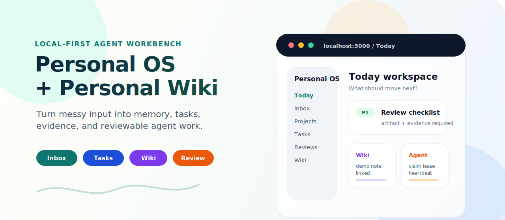
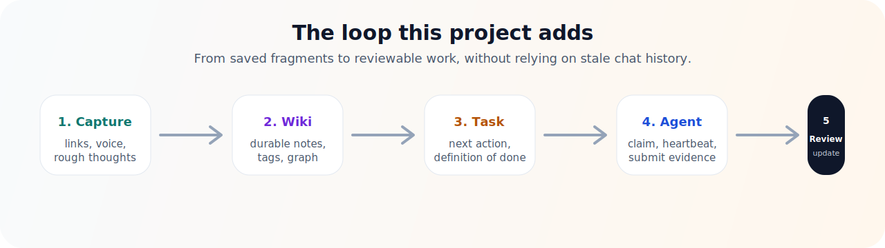
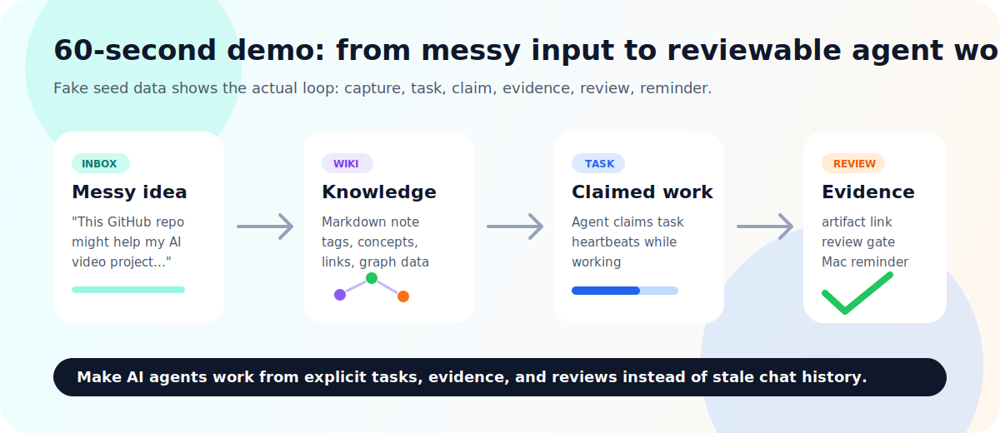
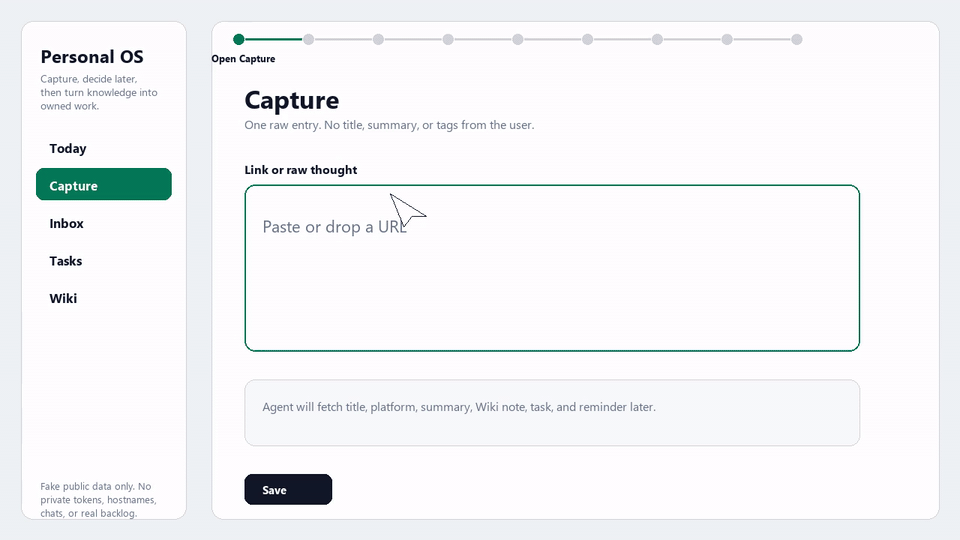
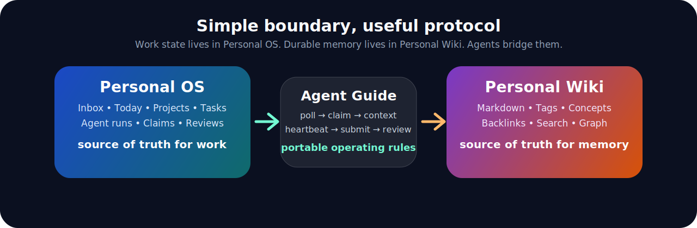

# Personal OS + Personal Wiki

<p align="center">
  
</p>

[](https://github.com/lawyer112/personal-os-wiki/actions/workflows/ci.yml)
[](./CHANGELOG.md)
[](./LICENSE)
[](#data-safety)
[](#agent-protocol)
[](#personal-wiki)
[](#agent-protocol)

<p align="center">
  <a href="#10-minute-demo-path"></a>
  <a href="./README.zh-CN.md"></a>
  <a href="./docs/GETTING_STARTED.md"></a>
  <a href="./docs/DEPLOYMENT.md"></a>
  <a href="./docs/MACOS_DEPLOYMENT.md"></a>
  <a href="./docs/RELEASES.md"></a>
  <a href="./docs/WHY_NOT_LONG_TERM_MEMORY.md"></a>
  <a href="./docs/MAC_AGENT_ADAPTER.md"></a>
  <a href="./docs/AGENT_GUIDE.md"></a>
  <a href="./docs/AGENT_PROMPT.md"></a>
  <a href="./docs/API_OVERVIEW.md"></a>
  <a href="./docs/DATA_SAFETY.md"></a>
</p>

[中文说明](./README.zh-CN.md)

**Category:** local-first agent workbench, LLM Wiki-style Markdown knowledge
base, knowledge graph, task execution protocol.

<details>
<summary><strong>中文速览：这不是第二大脑，是推进引擎</strong></summary>

Personal OS + Personal Wiki 把收藏夹、语音转写、碎碎念、项目进展和 Agent 产物，变成有人认领、有人提交证据、有人复核的任务。

它的核心闭环是：

```text
碎片输入 -> Wiki 长期记忆 -> 可执行任务
  -> Agent 认领 -> 提交证据 -> 人或 Reviewer 复核
  -> 结果回写知识库，供下一轮继续使用
```

完整中文说明见 [README.zh-CN.md](./README.zh-CN.md)。

</details>

**Make AI agents work from explicit tasks, evidence, and reviews instead of
stale chat history.**

Personal OS + Personal Wiki turns saved links, voice notes, rough ideas,
project updates, and agent output into claimed work with evidence.

Most tools help you collect more. This project is for the harder moment after
collection:

> What should happen next? Who owns it? What evidence proves it moved?

If your pain is "I saved it, summarized it, and still nothing shipped," this is
the missing layer: a local-first operating loop where humans can think messily
and agents work against explicit state instead of guessing from chat history.

```text
messy input -> durable wiki memory -> executable tasks
  -> agent claim -> evidence submission -> human/reviewer approval
  -> knowledge base updated for the next run
```

<p align="center">
  
</p>

<p align="center">
  
</p>

## Try It In One Command

Run the seeded local demo:

macOS / Linux:

```bash
sh ./scripts/demo.sh
```

Windows PowerShell:

```powershell
powershell -NoProfile -ExecutionPolicy Bypass -File .\scripts\demo.ps1
```

Equivalent Docker command:

```bash
docker compose up -d --build
```

Open Personal OS:

```text
http://localhost:3000/auth/read
read token: demo-read-token
```

Open Personal Wiki:

```text
http://localhost:3422/auth/read
read token: demo-wiki-read-token
```

The demo uses invented data only and binds ports to `127.0.0.1`.

## One Product, Two Web Services

This repository is one product and one release package. At runtime it starts
separate services: Personal OS for work state, Personal Wiki for Markdown
knowledge, and Postgres for OS data. The two browser URLs in the demo are
therefore expected, not two unrelated installs.

```text
Personal OS   http://localhost:3000   tasks, projects, agent runs, reviews
Personal Wiki http://localhost:3422   notes, tags, concepts, graph
Postgres      internal / 54329        Personal OS database
```

Personal OS links to Personal Wiki through `NEXT_PUBLIC_WIKI_URL` and talks to
it through `WIKI_READ_TOKEN` / `WIKI_API_TOKEN`. It does not currently proxy
Wiki pages as an internal `/wiki/*` route. For remote access, put both behind
authenticated HTTPS, preferably as two hostnames such as `os.example.internal`
and `wiki.example.internal`.

Read the full topology explanation:
[`docs/SERVICE_TOPOLOGY.md`](./docs/SERVICE_TOPOLOGY.md).

## Product Demo

This demo uses fake public data and shows the full product loop: web capture
records a link without spending LLM tokens, an agent later processes the Inbox
item into Wiki knowledge, a reviewable task, and a Telegram-ready reminder
payload.

<p align="center">
  <a href="./docs/assets/demo/personal-os-wiki-readme-demo.en.mp4">
    
  </a>
</p>

[English MP4](./docs/assets/demo/personal-os-wiki-readme-demo.en.mp4) ·
[Chinese MP4](./docs/assets/demo/personal-os-wiki-readme-demo.zh-CN.mp4)

## Related Ecosystem

This project sits near the Karpathy-style LLM Wiki, Markdown-as-memory, personal
knowledge graph, and agent-memory ecosystem.

The difference is the execution layer. Tools in the LLM Wiki space are strong
at turning documents into linked knowledge. Personal OS + Personal Wiki keeps
that idea, then adds Inbox, Today, task claiming, heartbeats, evidence
submission, reviews, and reminder payloads so agents can push projects forward
instead of only making the knowledge base prettier.

If you are exploring LLM Wiki, knowledge graphs, Obsidian-style vaults, or
agent long-term memory, this repository is the "what happens next?" layer:
turn knowledge into owned work.

The implementation direction is captured in
[`docs/KNOWLEDGE_SYSTEM_PLAN.md`](./docs/KNOWLEDGE_SYSTEM_PLAN.md): one-field
raw capture, policy-driven enrichment, Wiki linting, and scored relationship
edges so weak associations do not clutter the graph.

## What This Project Is

Personal OS + Personal Wiki is a local-first workbench for people who want AI
agents to help them move real projects forward, not just summarize notes.

It gives you three connected layers:

| Layer | Job | Why it matters |
| --- | --- | --- |
| **Personal OS** | Inbox, ideas, projects, tasks, today view, agent runs, task claims, reviews, notifications. | This is the execution state. It says what is unfinished, who owns it, and what counts as done. |
| **Personal Wiki** | Markdown notes, concepts, tags, backlinks, search, graph data, browser pages, sanitized long-term memory. | This is the durable knowledge base. It preserves context without dumping private runtime data into Git. |
| **Agent Guide** | A written operating manual and API contract for Hermes, Codex, or any other worker agent. | Agents do not improvise from chat history. They read the manual, call APIs, claim work, submit evidence, and wait for review. |

The project is opinionated: a useful personal knowledge base should not only
remember what you saw. It should expose what is still unfinished and make it
easy for another agent to push the work forward.

## Why Not Just Long-Term Memory?

Agent memory remembers the person. Personal OS tracks the work. Personal Wiki
preserves the evidence.

This distinction matters because long-term memory is a poor source of truth for
unfinished work. It can remember that something was discussed, but it does not
usually provide task claims, heartbeats, review decisions, artifacts, reminder
payloads, or a shared API contract for other agents.

Hermes, Codex, OpenClaw, or a scheduled worker should use built-in memory for
stable user preferences. They should use this project for external work state:
Inbox traces, Wiki evidence, task ownership, Today planning, reminder payloads,
and reviewable outputs.

Read the detailed comparison:
[`docs/WHY_NOT_LONG_TERM_MEMORY.md`](./docs/WHY_NOT_LONG_TERM_MEMORY.md).

## What You Can Do With It

| Use case | What happens |
| --- | --- |
| Save links that usually die in bookmarks | Capture the raw link, summarize it into Wiki memory, and extract follow-up tasks. |
| Dump "rambling" project thoughts | Preserve the original Inbox item, turn the stable part into knowledge, and turn the actionable part into tasks. |
| Run several agents against one backlog | Agents poll tasks by tags, claim work, heartbeat while working, submit contributions, and request review. |
| Keep a private project brain without leaking data | Source code and fake examples go to Git; real vaults, tokens, server inventories, and task history stay local. |
| Build a revenue/work dashboard | Projects, today view, unfinished tasks, and review queues make "what moves the project" visible. |
| Use the Wiki as agent memory | Agents can read curated Markdown context instead of relying on stale chat history. |
| Push reminders to real surfaces | Hermes or a scheduled worker can call planner/reminder APIs, then send nudges through Telegram, Feishu, Apple Reminders on a Mac, email, or desktop notifications. |

For Mac-side reminder sync, see
[`docs/MAC_AGENT_ADAPTER.md`](./docs/MAC_AGENT_ADAPTER.md). It defines how a Mac
worker should call planner/reminder APIs, write Apple Reminders, deduplicate
items, and avoid treating reminder completion as task completion.

For running the full system on macOS, see
[`docs/MACOS_DEPLOYMENT.md`](./docs/MACOS_DEPLOYMENT.md). It separates the
one-command demo from a real private Mac install, covers Docker Desktop,
Colima, backups, launchd-safe token handling, and Mac adapter wiring.

## Feature Overview

### Personal OS

- Inbox for raw human input and agent observations.
- Ideas, projects, tasks, notes, activity feed, and Today workspace.
- Agent-facing task protocol: inbox polling, claim, heartbeat, contribution,
  submit, review, block, archive.
- Read and write token boundaries for agent integrations.
- Planner and notification payloads for daily guidance.
- Reminder/planner APIs that external adapters can deliver to Telegram, Feishu,
  Apple Reminders, email, or desktop notifications.
- Next.js app backed by PostgreSQL and Prisma.

### Personal Wiki

- Markdown vault with browser pages.
- Ingest API for writing notes from agents or local tools.
- Search, tags, concepts, graph data, backlinks, and wiki-style navigation.
- Separate read and write token defaults.
- Docker-friendly Python service.
- Compatible with the "Markdown as durable memory" workflow.

### Agent Workflow

Agents use a predictable loop:

```text
poll -> claim -> load context -> execute -> heartbeat -> contribute -> submit -> review
```

That loop is the difference between "an agent wrote something in a chat" and
"a task was claimed, worked, evidenced, and reviewed."

## Deployment Requirements

Recommended path: Docker Compose on a Linux host, with app ports bound to
localhost and exposed only through an authenticated HTTPS reverse proxy.

| Item | Recommendation |
| --- | --- |
| Host | Linux server, macOS, or Windows with WSL2/Docker Desktop |
| Minimum size | 2 CPU cores, 2 GB RAM, 10 GB free disk |
| Comfortable size | 4 CPU cores, 4-8 GB RAM, 20+ GB disk plus backups |
| Required tools | Docker Compose, Git, `curl`; Node.js 24+ for local OS development |
| Main ports | Wiki `3422`, OS dev `3000`, OS prod `3100`, local Postgres `54329` |
| Data to back up | Wiki data directory, Postgres database, and out-of-Git secret storage |

Docker is recommended, not mandatory. Operators can also run Personal Wiki as a
Python service and Personal OS as a Node.js service, but then they own process
supervision, upgrades, TLS, authentication, and backups.

Read the full deployment guide:
[`docs/DEPLOYMENT.md`](./docs/DEPLOYMENT.md).

For macOS-specific setup, read
[`docs/MACOS_DEPLOYMENT.md`](./docs/MACOS_DEPLOYMENT.md).

## Install A Versioned Release

Normal users should deploy from a tagged release instead of tracking `main`.

Download a GitHub Release asset:

```text
personal-os-wiki-v0.1.1.zip
personal-os-wiki-v0.1.1.tar.gz
SHA256SUMS.txt
```

Then verify the checksum, extract the archive, copy `.env.example` to `.env`,
replace the placeholder tokens, and follow the Getting Started or Deployment
guide.

Developers can also clone a fixed version:

```bash
git clone --branch v0.1.1 https://github.com/lawyer112/personal-os-wiki.git
cd personal-os-wiki
```

Read the release packaging guide:
[`docs/RELEASES.md`](./docs/RELEASES.md).

## 10-Minute Demo Path

This is the fastest way to understand the system locally.

### 1. Start Personal Wiki

```bash
cd personal-wiki
cp .env.example .env
docker compose up -d --build
```

Open:

```text
http://localhost:3422
```

### 2. Start Personal OS

```bash
cd ../personal-os-app
cp .env.example .env
docker compose up -d postgres
npm ci
npm run prisma:generate
npm run prisma:migrate
npm run prisma:seed
npm run dev
```

Open:

```text
http://localhost:3000
```

For the full OS/Wiki integration, set `WIKI_API_TOKEN` and `WIKI_READ_TOKEN` in
`personal-os-app/.env` to match `personal-wiki/.env`.

### 3. Try the loop

After seeding, you should see fictional demo data:

| Surface | Demo item |
| --- | --- |
| Projects | `Acorn Launch Lab` |
| Inbox | `Demo input: collect three customer notes...` |
| Tasks | `Review the fictional launch checklist` with a fake claim, artifact, and approved review |
| Ideas | `Add a demo screenshot after UI polish` |
| Notes | `Demo launch checklist` |

Suggested path:

1. Open `Today` to see the current work queue.
2. Open `Tasks` and inspect `Review the fictional launch checklist`.
3. Check the next action, definition of done, Wiki link, fake agent claim,
   contribution, artifact, and reviewer decision.
4. Open `Projects` and inspect `Acorn Launch Lab`.
5. Open `Ideas` and confirm the screenshot idea stayed as an idea instead of
   being forced into a task.

The full walkthrough is in
[`docs/GETTING_STARTED.md`](./docs/GETTING_STARTED.md).

## Screenshots

Public screenshots should use fake seed data only. The screenshot capture list
is tracked in [`docs/assets/screenshots/README.md`](./docs/assets/screenshots/README.md).

Planned captures:

- Today workspace
- Task review flow
- Project timeline
- Agent context panel
- Wiki note graph

## Architecture

<p align="center">
  
</p>

```text
Human input
  |  links, voice transcripts, project notes, file summaries, rough thoughts
  v
Personal OS /api/intake
  |-- InboxItem: original trace
  |-- Idea: not-yet-actionable thought
  |-- Task: executable next action
  |-- ProjectEvent: project timeline
  |-- AgentRun: what an agent decided
  |
  +--> Personal Wiki /api/ingest
       |-- Markdown note
       |-- tags and concepts
       |-- search index
       |-- graph links

Worker agents
  |-- poll /api/agent-inbox
  |-- claim /api/tasks/:id/claim
  |-- read /api/agent/context
  |-- heartbeat while working
  |-- submit contribution and artifacts
  v
Human or reviewer agent approves, requests changes, blocks, or archives
```

The important boundary is simple:

```text
Personal OS   = work state
Personal Wiki = durable knowledge
Agent Guide   = portable operating rules
```

Read more:

- [Architecture](./docs/ARCHITECTURE.md)
- [Agent Guide](./docs/AGENT_GUIDE.md)
- [Copyable Agent Prompt](./docs/AGENT_PROMPT.md)
- [Hermes API contract](./personal-os-app/docs/HERMES_API.md)

## Agent Protocol

An agent should not scrape the whole vault or guess from chat history. It should
follow the contract.

Example task claiming flow:

```bash
# 1. Poll work
curl -H "Authorization: Bearer $PERSONAL_OS_API_TOKEN" \
  "http://localhost:3000/api/agent-inbox?agentId=research-agent&tags=wiki,research"

# 2. Claim one task
curl -X POST \
  -H "Authorization: Bearer $PERSONAL_OS_API_TOKEN" \
  -H "Content-Type: application/json" \
  -d '{"agentId":"research-agent","leaseMinutes":30}' \
  "http://localhost:3000/api/tasks/<task-id>/claim"

# 3. Load context
curl -H "Authorization: Bearer $PERSONAL_OS_READ_TOKEN" \
  "http://localhost:3000/api/agent/context?taskId=<task-id>"

# 4. Submit evidence when done
curl -X POST \
  -H "Authorization: Bearer $PERSONAL_OS_API_TOKEN" \
  -H "Content-Type: application/json" \
  -d '{"agentId":"research-agent","summary":"What changed","artifactUrls":["https://example.com/demo"],"evidenceLinks":["wiki://demo/demo-launch-checklist.md"],"definitionOfDoneMet":true,"needsHumanDecision":true}' \
  "http://localhost:3000/api/tasks/<task-id>/submit"
```

For the complete protocol, read
[`docs/AGENT_GUIDE.md`](./docs/AGENT_GUIDE.md) and
[`docs/API_OVERVIEW.md`](./docs/API_OVERVIEW.md).

## What Makes This Different From A Normal Wiki

| Normal note app | This project |
| --- | --- |
| Stores notes | Stores knowledge and extracts execution state |
| Search is the main interface | Tasks, Today, projects, graph, and agent context all matter |
| AI summarizes content | Agents can claim work and submit reviewable evidence |
| Links can disappear into an archive | Links can become Wiki pages and follow-up tasks |
| "Done" means text was written | "Done" means a task was reviewed or explicitly archived |
| Private data often gets mixed with code | Runtime data is designed to stay outside Git |

## Data Safety

This repository is the reusable engine, not a dump of a private life or private
infrastructure.

Safe to commit:

- application source code
- tests
- documentation
- `.env.example` templates
- Docker and compose files that use placeholders
- fake demo data

Never commit:

- `.env` files or agent credential exports
- populated Wiki vaults
- real inbox messages, task history, reminders, or project notes
- server inventory with private LAN addresses, ports, paths, or business mapping
- logs, pid files, generated bundles, screenshots, `.next`, `node_modules`

Read the full release checklist:

- [Data safety](./docs/DATA_SAFETY.md)
- [Open source release process](./OPEN_SOURCE_RELEASE.md)
- [Security policy](./SECURITY.md)
- [Repository permissions](./docs/PERMISSIONS.md)

## Documentation Map

| Goal | Read |
| --- | --- |
| Understand the product | This README |
| Run it locally | [Getting Started](./docs/GETTING_STARTED.md) |
| Run the one-command demo | `docker compose up -d --build` or [Getting Started](./docs/GETTING_STARTED.md) |
| Check deployment requirements | [Deployment Guide](./docs/DEPLOYMENT.md) |
| Deploy on macOS | [macOS Deployment Guide](./docs/MACOS_DEPLOYMENT.md) |
| Install a fixed version | [Releases and packages](./docs/RELEASES.md) |
| Understand architecture | [Architecture](./docs/ARCHITECTURE.md) |
| Understand the human-agent collaboration direction | [Human-Agent Collaboration Roadmap](./docs/HUMAN_AGENT_COLLABORATION_ROADMAP.md) |
| Understand raw capture and agent enrichment | [Knowledge System Plan](./docs/KNOWLEDGE_SYSTEM_PLAN.md) and [Web Capture](./docs/WEB_CAPTURE.md) |
| Compare with memory/wiki/task tools | [Comparison](./docs/COMPARISON.md) |
| Launch or package the repo | [Launch playbook](./docs/LAUNCH_PLAYBOOK.md) |
| Connect an agent | [Agent Guide](./docs/AGENT_GUIDE.md), [Agent Prompt](./docs/AGENT_PROMPT.md), [API Overview](./docs/API_OVERVIEW.md), and [Hermes API](./personal-os-app/docs/HERMES_API.md) |
| Schedule worker agents | [Agent Job Orchestration](./docs/AGENT_JOB_ORCHESTRATION.md) |
| Operate Personal OS | [Personal OS README](./personal-os-app/README.md) |
| Operate Personal Wiki | [Personal Wiki README](./personal-wiki/README.md) and [Wiki usage](./personal-wiki/docs/USAGE.md) |
| Understand data safety | [Data safety](./docs/DATA_SAFETY.md) |
| Publish safely | [Open source release process](./OPEN_SOURCE_RELEASE.md) |
| Decide monorepo vs split repos | [Repository strategy](./docs/REPOSITORY_STRATEGY.md) |
| Follow the long-term object-knowledge rebuild | [Object Knowledge Rebuild Manual](./docs/OBJECT_KNOWLEDGE_REBUILD_MANUAL.md) |
| See what is next | [Roadmap](./docs/ROADMAP.md) |

## Roadmap

The short version:

- Improve public screenshots and the browser walkthrough.
- Add more agent task-claiming examples and smoke scripts.
- Improve task extraction from messy input.
- Add richer project dashboards and priority views.
- Rebuild Wiki as typed object knowledge with explainable graph relations,
  lint issues, and OS-generated maintenance tasks.

Read the full [roadmap](./docs/ROADMAP.md).

## Limitations And Maturity

- This is not a hosted SaaS product.
- This is not a multi-tenant organization system.
- Built-in auth is token based; public deployments should sit behind an
  authenticated reverse proxy.
- Runtime data is not encrypted by the app itself.
- Agents cannot bypass review by design, but bad submissions still require
  human or reviewer-agent judgment.
- The first-run demo is intentionally fake and small.

## Project Status

This is an early public release. The current package version is tracked in
[`VERSION`](./VERSION) and [`CHANGELOG.md`](./CHANGELOG.md). It is useful for
builders who want to study or adapt a local-first agent workbench, but it is not
a hosted SaaS product and it does not include your private knowledge base. Treat
it as an engine, not as a cloud service.

## Contributing

Contributions are welcome if they keep the same boundary:

- do not add real private data;
- keep local-first defaults safe;
- document API behavior when changing agent-facing routes;
- add or update tests for execution-state changes.

Start with [CONTRIBUTING.md](./CONTRIBUTING.md).
