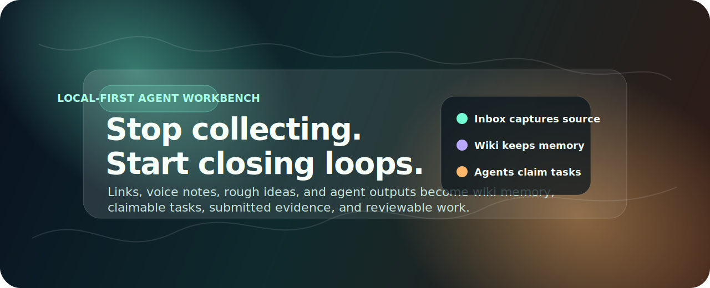

# Personal OS + Personal Wiki

<p align="center">
  
</p>

[](https://github.com/lawyer112/personal-os-wiki/actions/workflows/ci.yml)
[](./LICENSE)
[](#数据安全)
[](#agent-协议)
[](#personal-wiki)
[](#agent-协议)

<p align="center">
  <a href="#10-分钟-demo"></a>
  <a href="./docs/GETTING_STARTED.zh-CN.md"></a>
  <a href="./docs/AGENT_GUIDE.zh-CN.md"></a>
  <a href="./docs/API_OVERVIEW.md"></a>
  <a href="./docs/DATA_SAFETY.zh-CN.md"></a>
</p>

[English README](./README.md)

**项目类型：** 本地优先 Agent 工作台、Markdown 知识库、任务执行协议。

**不是第二大脑，是推进引擎。**

Personal OS + Personal Wiki 把收藏夹、语音转写、碎碎念、项目进展和 Agent 产物，变成有人认领、有人提交证据、有人复核的任务。

大多数工具帮你“存下来”。这个项目处理的是存下来之后真正困难的部分：

> 接下来该做什么？谁负责？做到什么程度才算真的推进了？

如果你的痛点是“我收藏了、总结了、让 Agent 看过了，但最后还是没有产出”，那这里补的是中间缺失的一层：一个本地优先的推进闭环。人可以说得很乱，Agent 不能靠猜，它要面对明确的状态、任务和验收口径工作。

```text
碎片输入 -> Wiki 长期记忆 -> 可执行任务
  -> Agent 认领 -> 提交证据 -> 人或 Reviewer 复核
  -> 结果回写知识库，供下一轮继续使用
```

<p align="center">
  
</p>

## 这是什么

Personal OS + Personal Wiki 是一个本地优先的个人工作台，用来让 AI Agent 不只是总结笔记，而是真的帮助你推进项目。

它由三层组成：

| 层 | 负责什么 | 为什么重要 |
| --- | --- | --- |
| **Personal OS** | Inbox、Ideas、Projects、Tasks、Today、AgentRun、任务认领、复核、通知。 | 这是执行状态层。它回答什么没完成、谁负责、做到什么算完成。 |
| **Personal Wiki** | Markdown 笔记、概念、标签、双链、搜索、图谱、浏览页面、长期记忆。 | 这是知识层。它保留上下文，但不把真实运行数据混进公开仓库。 |
| **Agent Guide** | 给 Hermes、Codex 或其他 worker agent 看的操作手册和 API 合约。 | Agent 不靠聊天记录猜流程，而是读手册、调接口、认领任务、提交证据、等待复核。 |

这个项目的核心判断是：个人知识库不应该只帮你记住“看过什么”，还应该暴露“什么还没完成”，并让另一个 Agent 能接着往前顶。

## 它能做什么

| 场景 | 系统会怎么处理 |
| --- | --- |
| 收藏夹里很多链接长期吃灰 | 保留原始链接，沉淀 Wiki 摘要，并抽取后续任务。 |
| 你说了一堆项目碎碎念 | 原文进入 Inbox，稳定结论进 Wiki，可执行动作进 Task。 |
| 多个 Agent 扫同一个任务池 | Agent 按标签拉任务、认领、心跳续约、提交进展、等待复核。 |
| 想要私有项目大脑但又要开源代码 | 源码和虚构 demo 可以进 Git，真实 vault、token、服务器台账和任务历史留在本地。 |
| 想把知识库服务于挣钱和项目推进 | Projects、Today、未完成任务和 Review 队列让“什么能推动项目”变得可见。 |
| 想把 Wiki 当成 Agent 记忆 | Agent 读取整理过的 Markdown 上下文，而不是依赖过期聊天记录。 |

## 功能概览

### Personal OS

- Inbox：保留原始输入和 Agent 观察。
- Ideas、Projects、Tasks、Notes、Activity、Today 工作台。
- Agent 任务协议：拉任务、认领、心跳、写贡献、提交、复核、阻塞、归档。
- 面向 Agent 的读写 token 边界。
- 日计划和通知 payload。
- Next.js + PostgreSQL + Prisma。

### Personal Wiki

- Markdown vault 和浏览器页面。
- Agent 或本地工具可调用的入库 API。
- 搜索、标签、概念、图谱、双链和 Wiki 导航。
- 默认区分读 token 和写 token。
- Python 服务，可用 Docker 启动。
- 兼容“Markdown 作为长期记忆”的工作流。

### Agent 工作流

Agent 使用固定循环：

```text
poll -> claim -> load context -> execute -> heartbeat -> contribute -> submit -> review
```

这个循环的意义是：不是“Agent 在聊天里写了一段话”，而是“任务被认领、执行、提交证据，并进入复核”。

## 10 分钟 Demo

这是最快理解系统的方式。

### 1. 启动 Personal Wiki

```bash
cd personal-wiki
cp .env.example .env
docker compose up -d --build
```

打开：

```text
http://localhost:3422
```

### 2. 启动 Personal OS

```bash
cd personal-os-app
cp .env.example .env
docker compose up -d postgres
npm ci
npm run prisma:generate
npm run prisma:migrate
npm run prisma:seed
npm run dev
```

打开：

```text
http://localhost:3000
```

### 3. 看 demo 闭环

seed 后你会看到一组虚构数据：

| 页面 | demo 内容 |
| --- | --- |
| Projects | `Acorn Launch Lab` |
| Inbox | `Demo input: collect three customer notes...` |
| Tasks | `Review the fictional launch checklist` |
| Ideas | `Add a demo screenshot after UI polish` |
| Notes | `Demo launch checklist` |

建议点击路径：

1. 打开 `Today`，看当前任务队列。
2. 打开 `Tasks`，进入 `Review the fictional launch checklist`。
3. 查看下一步动作、完成定义、Wiki 链接、贡献记录和 artifact。
4. 打开 `Projects`，查看 `Acorn Launch Lab` 如何串起任务和知识。
5. 打开 `Ideas`，确认不成熟想法不会被硬转成任务。

完整教程见：

- [快速上手](./docs/GETTING_STARTED.zh-CN.md)
- [Getting Started](./docs/GETTING_STARTED.md)

## 架构图

<p align="center">
  
</p>

```text
用户输入
  |  链接、语音转写、项目想法、文件摘要、临时吐槽
  v
Personal OS /api/intake
  |-- InboxItem: 原始记录
  |-- Idea: 还没成熟的想法
  |-- Task: 可执行下一步
  |-- ProjectEvent: 项目时间线
  |-- AgentRun: Agent 当时怎么判断
  |
  +--> Personal Wiki /api/ingest
       |-- Markdown 笔记
       |-- 标签和概念
       |-- 搜索索引
       |-- 图谱关系

Worker Agent
  |-- poll /api/agent-inbox
  |-- claim /api/tasks/:id/claim
  |-- read /api/agent/context
  |-- heartbeat while working
  |-- submit contribution and artifacts
  v
人或 Reviewer Agent 审核：通过、打回、阻塞、归档
```

边界很简单：

```text
Personal OS   = 工作状态
Personal Wiki = 长期知识
Agent Guide   = 可移植操作规则
```

更多说明：

- [架构说明](./docs/ARCHITECTURE.zh-CN.md)
- [Agent 使用手册](./docs/AGENT_GUIDE.zh-CN.md)
- [Hermes API 合约](./personal-os-app/docs/HERMES_API.md)

## Agent 协议

Agent 不应该扫描整个 vault，也不应该靠聊天记录猜。它应该遵守协议。

最小任务认领流程：

```bash
# 1. 拉取任务
curl -H "Authorization: Bearer $PERSONAL_OS_API_TOKEN" \
  "http://localhost:3000/api/agent-inbox?agentId=research-agent&tags=wiki,research"

# 2. 认领任务
curl -X POST \
  -H "Authorization: Bearer $PERSONAL_OS_API_TOKEN" \
  -H "Content-Type: application/json" \
  -d '{"agentId":"research-agent","leaseMinutes":30}' \
  "http://localhost:3000/api/tasks/<task-id>/claim"

# 3. 读取上下文
curl -H "Authorization: Bearer $PERSONAL_OS_READ_TOKEN" \
  "http://localhost:3000/api/agent/context?taskId=<task-id>"

# 4. 完成后提交证据
curl -X POST \
  -H "Authorization: Bearer $PERSONAL_OS_API_TOKEN" \
  -H "Content-Type: application/json" \
  -d '{"agentId":"research-agent","summary":"What changed","artifactUrls":["https://example.com/demo"],"evidenceLinks":["wiki://demo/demo-launch-checklist.md"],"definitionOfDoneMet":true,"needsHumanDecision":true}' \
  "http://localhost:3000/api/tasks/<task-id>/submit"
```

完整协议见：

- [Agent 使用手册](./docs/AGENT_GUIDE.zh-CN.md)
- [API 总览](./docs/API_OVERVIEW.md)

## 和普通 Wiki 有什么区别

| 普通笔记工具 | 这个项目 |
| --- | --- |
| 主要存笔记 | 同时存知识和执行状态 |
| 搜索是主要入口 | Tasks、Today、Projects、Graph、Agent Context 都是入口 |
| AI 负责总结 | Agent 可以认领任务并提交可复核证据 |
| 链接容易变成档案 | 链接可以变成 Wiki 页面和后续任务 |
| 写完文字就像完成 | 任务要复核通过或明确归档才算闭环 |
| 私有数据容易和代码混在一起 | 运行数据设计上不进 Git |

## 数据安全

这个仓库是可复用引擎，不是私人生活或私有基础设施的备份。

可以提交：

- 源码
- 测试
- 文档
- `.env.example`
- 使用占位值的 Docker / compose 文件
- 虚构 demo 数据

不能提交：

- `.env` 或 agent credential export
- 真实 Wiki vault
- 真实 Inbox、任务、提醒事项、项目历史
- 包含内网地址、端口、路径、业务映射的服务器台账
- 日志、pid、构建产物、截图、`.next`、`node_modules`

更多安全边界：

- [数据安全](./docs/DATA_SAFETY.zh-CN.md)
- [Open source release process](./OPEN_SOURCE_RELEASE.md)
- [Security policy](./SECURITY.md)
- [Repository permissions](./docs/PERMISSIONS.md)

## 文档地图

| 目标 | 阅读 |
| --- | --- |
| 理解项目 | 本 README |
| 本地跑起来 | [快速上手](./docs/GETTING_STARTED.zh-CN.md) |
| 理解架构 | [架构说明](./docs/ARCHITECTURE.zh-CN.md) |
| 接入 Agent | [Agent 使用手册](./docs/AGENT_GUIDE.zh-CN.md) 和 [API 总览](./docs/API_OVERVIEW.md) |
| 使用 Personal OS | [Personal OS README](./personal-os-app/README.md) |
| 使用 Personal Wiki | [Personal Wiki README](./personal-wiki/README.md) 和 [Wiki 使用手册](./personal-wiki/docs/USAGE.md) |
| 安全发布 | [Open source release process](./OPEN_SOURCE_RELEASE.md) |
| 判断是否拆仓 | [仓库拆分与开源策略](./docs/REPOSITORY_STRATEGY.zh-CN.md) |

## 路线图

短期：

- 补更完整的首轮 demo 截图和浏览器导览。
- 增加 Agent 认领、提交、复核的更多示例。
- 增加更多通知适配器。
- 改进任务抽取和“说人话”的任务文案。

中期：

- 更强的项目看板和收入/产出优先级视图。
- Agent 按能力标签自我认领任务。
- Wiki 图谱洞察和知识缺口发现。
- 更安全的个人 vault 导入导出流程。

## 项目状态

这是一个早期公开版本。它适合给想研究或改造“本地优先 Agent 工作台”的开发者看，但它不是云服务，也不包含你的私人知识库。请把它当作一个可复用引擎，而不是直接托管好的产品。

## 贡献

欢迎贡献，但要保持边界：

- 不加入真实私人数据；
- 保持本地优先和安全默认值；
- 改 agent-facing API 时同步更新文档；
- 修改执行状态相关逻辑时补测试。

从 [CONTRIBUTING.md](./CONTRIBUTING.md) 开始。
