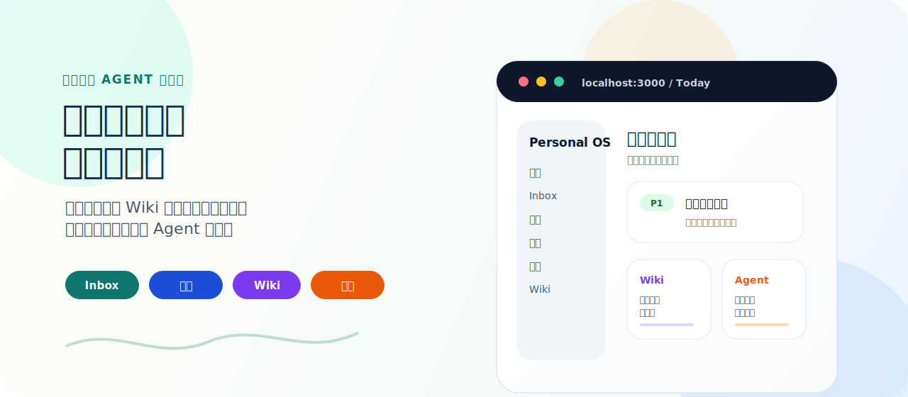
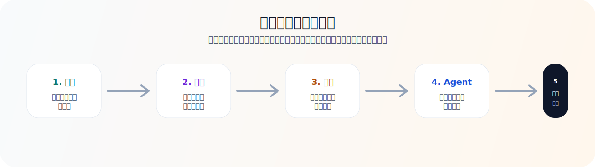
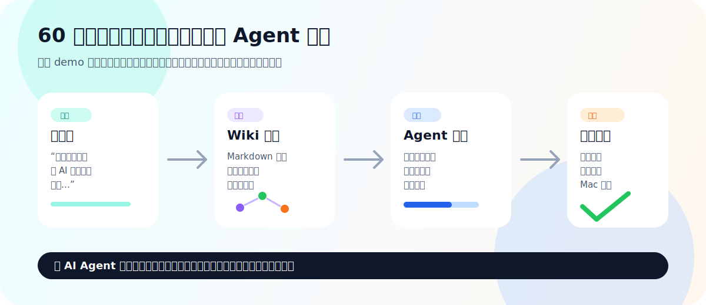
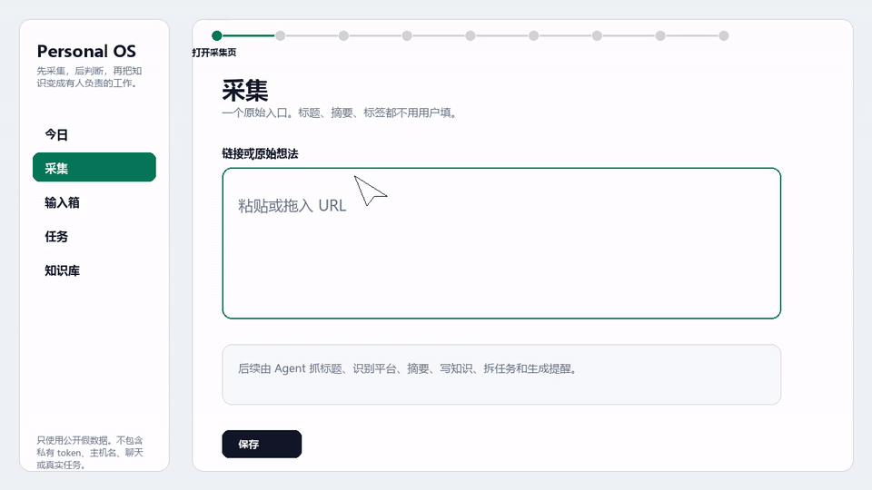
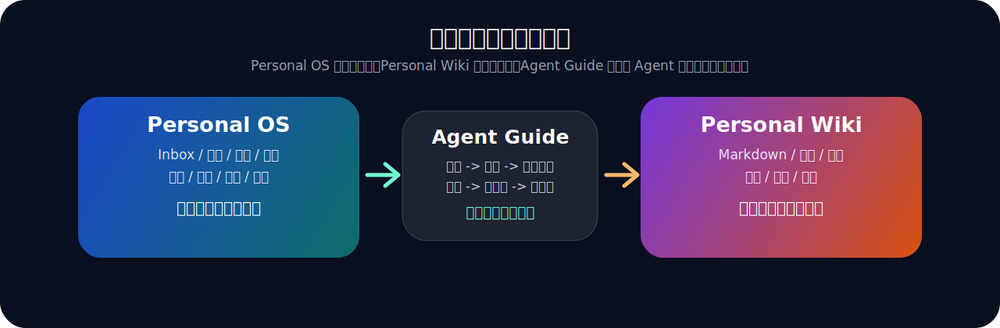

# Personal OS + Personal Wiki

<p align="center">
  
</p>

[](https://github.com/lawyer112/personal-os-wiki/actions/workflows/ci.yml)
[](./CHANGELOG.md)
[](./LICENSE)
[](#数据安全)
[](#agent-协议)
[](#personal-wiki)
[](#agent-协议)

<p align="center">
  <a href="#10-分钟-demo"></a>
  <a href="./docs/GETTING_STARTED.zh-CN.md"></a>
  <a href="./docs/DEPLOYMENT.zh-CN.md"></a>
  <a href="./docs/RELEASES.zh-CN.md"></a>
  <a href="./docs/WHY_NOT_LONG_TERM_MEMORY.zh-CN.md"></a>
  <a href="./docs/MAC_AGENT_ADAPTER.zh-CN.md"></a>
  <a href="./docs/AGENT_GUIDE.zh-CN.md"></a>
  <a href="./docs/AGENT_PROMPT.zh-CN.md"></a>
  <a href="./docs/API_OVERVIEW.zh-CN.md"></a>
  <a href="./docs/DATA_SAFETY.zh-CN.md"></a>
</p>

[English README](./README.md)

[macOS 部署指南](./docs/MACOS_DEPLOYMENT.zh-CN.md)

**项目类型：** 本地优先 Agent 工作台、LLM Wiki 风格 Markdown 知识库、知识图谱、任务执行协议。

**让 AI Agent 不再靠聊天记录瞎猜，而是从任务、证据和复核流程里干活。**

Personal OS + Personal Wiki 把收藏夹、语音转写、碎碎念、项目进展和 Agent 产物，变成有人认领、有人提交证据、有人复核的任务。

大多数工具帮你“存下来”。这个项目处理的是存下来之后真正困难的部分：

> 接下来该做什么？谁负责？做到什么程度才算真的推进了？

如果你的痛点是“我收藏了、总结了、让 Agent 看过了，但最后还是没有产出”，那这里补的是中间缺失的一层：一个本地优先的推进闭环。人可以说得很乱，Agent 不能靠猜，它要面对明确的状态、任务和验收口径工作。

```text
碎片输入 -> Wiki 长期记忆 -> 可执行任务
  -> Agent 认领 -> 提交证据 -> 人或 Reviewer 复核
  -> 结果回写知识库，供下一轮继续使用
```

<p align="center">
  
</p>

<p align="center">
  
</p>

## 一条命令跑 Demo

启动带虚构数据的本地 demo：

```bash
docker compose up -d --build
```

打开 Personal OS：

```text
http://localhost:3000/auth/read
read token: demo-read-token
```

打开 Personal Wiki：

```text
http://localhost:3422/auth/read
read token: demo-wiki-read-token
```

这个 demo 只使用虚构数据，并且端口默认只绑定 `127.0.0.1`。

## 一个产品，两个 Web 服务

这个仓库是一个产品，也是一个 Release 包。运行时会启动多个组件：
Personal OS 负责工作状态，Personal Wiki 负责 Markdown 知识库，Postgres
负责 OS 数据库。所以 demo 里出现两个浏览器地址是正常的，不是让用户安装两个
互不相关的项目。

```text
Personal OS   http://localhost:3000   任务、项目、Agent 运行记录、复核
Personal Wiki http://localhost:3422   笔记、标签、概念、图谱
Postgres      internal / 54329        Personal OS 数据库
```

Personal OS 通过 `NEXT_PUBLIC_WIKI_URL` 生成 Wiki 跳转链接，通过
`WIKI_READ_TOKEN` / `WIKI_API_TOKEN` 调用 Wiki API。当前它不会把 Wiki 页面
代理成自己的 `/wiki/*` 内部路由。远程访问时，建议把两个服务都放在带鉴权的
HTTPS 反向代理后面，例如 `os.example.internal` 和 `wiki.example.internal`。

完整说明见：[服务拓扑说明](./docs/SERVICE_TOPOLOGY.zh-CN.md)。

## 产品演示

这段演示只使用公开安全的假数据，展示完整产品闭环：网页采集先把链接记进输入箱，
不立即消耗大模型；Agent 稍后把它处理成知识库内容、可复核任务和 Telegram 提醒消息。

<p align="center">
  <a href="./docs/assets/demo/personal-os-wiki-readme-demo.zh-CN.mp4">
    
  </a>
</p>

[中文 MP4](./docs/assets/demo/personal-os-wiki-readme-demo.zh-CN.mp4) ·
[English MP4](./docs/assets/demo/personal-os-wiki-readme-demo.en.mp4)

更完整的项目级介绍见：
[HyperFrames 项目介绍 MP4](./docs/assets/demo/personal-os-wiki-project-intro.zh-CN.mp4)。

## 相关生态

这个项目和 Karpathy-style LLM Wiki、Markdown 作为长期记忆、个人知识图谱、
Agent memory 这些方向是相邻的。

区别在执行层。LLM Wiki 类工具很擅长把文档变成互相链接的知识；Personal OS
+ Personal Wiki 保留这个思路，然后继续加上 Inbox、Today、任务认领、心跳、
证据提交、复核和提醒 payload，让 Agent 不只是整理知识库，而是能把项目往前推。

如果你正在研究 LLM Wiki、知识图谱、Obsidian 风格 vault 或 Agent 长期记忆，
这个仓库更像是“下一步怎么办”的那一层：把知识变成有人负责、能检查进度的工作。

具体实现方向见：[知识系统落地方案](./docs/KNOWLEDGE_SYSTEM_PLAN.zh-CN.md)。它把
“一字段原始采集、按策略 enrichment、Wiki lint、关系强弱分数”写成后续实现准绳，
避免弱关联把图谱画乱。

## 这是什么

Personal OS + Personal Wiki 是一个本地优先的个人工作台，用来让 AI Agent 不只是总结笔记，而是真的帮助你推进项目。

它由三层组成：

| 层 | 负责什么 | 为什么重要 |
| --- | --- | --- |
| **Personal OS** | Inbox、Ideas、Projects、Tasks、Today、AgentRun、任务认领、复核、通知。 | 这是执行状态层。它回答什么没完成、谁负责、做到什么算完成。 |
| **Personal Wiki** | Markdown 笔记、概念、标签、双链、搜索、图谱、浏览页面、长期记忆。 | 这是知识层。它保留上下文，但不把真实运行数据混进公开仓库。 |
| **Agent Guide** | 给 Hermes、Codex 或其他 worker agent 看的操作手册和 API 合约。 | Agent 不靠聊天记录猜流程，而是读手册、调接口、认领任务、提交证据、等待复核。 |

这个项目的核心判断是：个人知识库不应该只帮你记住“看过什么”，还应该暴露“什么还没完成”，并让另一个 Agent 能接着往前顶。

## 为什么不只是长期记忆

Agent 长期记忆记住“这个人”。Personal OS 管“工作状态”。Personal Wiki 保存“证据和知识”。

这个区别很重要：长期记忆可以记住“我们聊过某件事”，但它通常没有任务认领、心跳、复核决定、产物链接、提醒 payload，也没有给其他 Agent 共用的 API 合约。

Hermes、Codex、OpenClaw 或定时 worker 应该把长期记忆用来保存稳定偏好；把这个项目用来管理外部工作状态：Inbox 原始痕迹、Wiki 证据、任务归属、Today 规划、提醒 payload 和可复核产物。

详细对比见：[为什么不只是长期记忆](./docs/WHY_NOT_LONG_TERM_MEMORY.zh-CN.md)。

## 它能做什么

| 场景 | 系统会怎么处理 |
| --- | --- |
| 收藏夹里很多链接长期吃灰 | 保留原始链接，沉淀 Wiki 摘要，并抽取后续任务。 |
| 你说了一堆项目碎碎念 | 原文进入 Inbox，稳定结论进 Wiki，可执行动作进 Task。 |
| 多个 Agent 扫同一个任务池 | Agent 按标签拉任务、认领、心跳续约、提交进展、等待复核。 |
| 想要私有项目大脑但又要开源代码 | 源码和虚构 demo 可以进 Git，真实 vault、token、服务器台账和任务历史留在本地。 |
| 想把知识库服务于挣钱和项目推进 | Projects、Today、未完成任务和 Review 队列让“什么能推动项目”变得可见。 |
| 想把 Wiki 当成 Agent 记忆 | Agent 读取整理过的 Markdown 上下文，而不是依赖过期聊天记录。 |
| 想把提醒发到真实软件 | Hermes 或定时 worker 调 planner/reminder API，再由 Telegram、飞书、Mac 上的 Apple 提醒事项、邮件或桌面通知 adapter 发出去。 |

Mac 侧提醒同步的具体操作见：[Mac Agent Adapter 操作手册](./docs/MAC_AGENT_ADAPTER.zh-CN.md)。它写清楚了 Mac worker 怎么调用 planner/reminder API、怎么写 Apple 提醒事项、怎么去重，以及为什么“勾掉提醒”不能等于“任务完成”。

## 功能概览

### Personal OS

- Inbox：保留原始输入和 Agent 观察。
- Ideas、Projects、Tasks、Notes、Activity、Today 工作台。
- Agent 任务协议：拉任务、认领、心跳、写贡献、提交、复核、阻塞、归档。
- 面向 Agent 的读写 token 边界。
- 日计划和通知 payload。
- 提醒/规划 API，可由外部 adapter 投递到 Telegram、飞书、Apple 提醒事项、邮件或桌面通知。
- Next.js + PostgreSQL + Prisma。

### 记忆召回（Agent Context）

\/api/agent/context?q=\ 接口返回结构化上下文包，从多个检索源融合而成：

- **意图路由**：查询分类为 \deploy_sop\u3001eview_protocol\u3001\concept\u3001\ops\u3001\act\u3001oise\u3001\general\uff0c按字段加权（title / path / tags / concepts / excerpt）和意图奖惩打分。
- **FTS chunk 检索**：Wiki 候选来自 BM25 排序的 FTS chunk，不是笔记级 substring。候选带 heading path、字符区间和 chunk 级 expand handles。
- **证据卡**：\evidence.cards\ - path 去重，硬顶 8 卡 + ~1500 token 预算。每张卡含 heading path、原文、chunkId、score 和 expand handles（eighbor\ / \section\ / \document\uff09。
- **分层记忆**：\memoryItems\ 分 \hot\ / \warm\ / \cold\uff0c带 token 预算；\	iers\ 从同一批 item 构建，保持一致性。
- **无 sticky 污染**：纯 \?q=\ 查询不注入无关全局 P0 任务或失败 agent run 到 extAction\u3002
- **按需展开**：显式“展开全文/上下文”触发 document/section/neighbor 展开；how-to 部署类查询自动展开到 section 级。

评测脚本和 B0 基线见
[\scripts/eval_b0_memory_baseline.py\](./scripts/eval_b0_memory_baseline.py)
和 [\docs/eval_b0_memory_baseline_2026-07-21.md\](./docs/eval_b0_memory_baseline_2026-07-21.md)。
持续改进路线图见
[\docs/MEMORY_RECALL_ROADMAP.zh-CN.md\](./docs/MEMORY_RECALL_ROADMAP.zh-CN.md)。

### Personal Wiki

- Markdown vault 和浏览器页面。
- Agent 或本地工具可调用的入库 API。
- 搜索、标签、概念、图谱、双链和 Wiki 导航。
- 默认区分读 token 和写 token。
- Python 服务，可用 Docker 启动。
- 兼容“Markdown 作为长期记忆”的工作流。

### Agent 工作流

Agent 使用固定循环：

```text
poll -> claim -> load context -> execute -> heartbeat -> contribute -> submit -> review
```

这个循环的意义是：不是“Agent 在聊天里写了一段话”，而是“任务被认领、执行、提交证据，并进入复核”。

## 部署环境要求

推荐路线：Linux 主机 + Docker Compose，应用端口只绑定 localhost，对外通过带鉴权的 HTTPS 反向代理访问。

| 项目 | 建议 |
| --- | --- |
| 主机 | Linux 服务器、macOS，或 Windows + WSL2/Docker Desktop |
| 最低配置 | 2 核 CPU、2 GB 内存、10 GB 可用磁盘 |
| 更舒服的配置 | 4 核 CPU、4-8 GB 内存、20+ GB 磁盘并预留备份空间 |
| 必装工具 | Docker Compose、Git、`curl`；本地开发 Personal OS 需要 Node.js 24+ |
| 主要端口 | Wiki `3422`、OS 开发 `3000`、OS 生产 `3100`、本地 Postgres `54329` |
| 必备备份 | Wiki 数据目录、Postgres 数据库、通过密码管理器保存的密钥 |

Docker 是推荐方案，不是硬性要求。也可以把 Personal Wiki 当 Python 服务跑，把 Personal OS 当 Node.js 服务跑；但这种方式需要你自己负责进程守护、升级、TLS、鉴权和备份。

完整部署说明见：[部署指南](./docs/DEPLOYMENT.zh-CN.md)。

## 按版本安装

普通用户应该优先使用固定 Release 版本，而不是直接跟踪 `main`。

下载 GitHub Release 里的产物：

```text
personal-os-wiki-v0.2.0.zip
personal-os-wiki-v0.2.0.tar.gz
SHA256SUMS.txt
```

校验 SHA256 后解压，把 `.env.example` 复制成 `.env`，替换占位 token，然后按
快速上手或部署指南执行。

开发者也可以按 tag 克隆：

```bash
git clone --branch v0.2.0 https://github.com/lawyer112/personal-os-wiki.git
cd personal-os-wiki
```

完整说明见：[版本发布与安装包](./docs/RELEASES.zh-CN.md)。

## 10 分钟 Demo

这是最快理解系统的方式。

### 1. 启动 Personal Wiki

```bash
cd personal-wiki
cp .env.example .env
docker compose up -d --build
```

打开：

```text
http://localhost:3422
```

### 2. 启动 Personal OS

```bash
cd personal-os-app
cp .env.example .env
docker compose up -d postgres
npm ci
npm run prisma:generate
npm run prisma:migrate
npm run prisma:seed
npm run dev
```

打开：

```text
http://localhost:3000
```

### 3. 看 demo 闭环

seed 后你会看到一组虚构数据：

| 页面 | demo 内容 |
| --- | --- |
| Projects | `Acorn Launch Lab` |
| Inbox | `Demo input: collect three customer notes...` |
| Tasks | `Review the fictional launch checklist`，带虚构的认领、artifact 和通过复核 |
| Ideas | `Add a demo screenshot after UI polish` |
| Notes | `Demo launch checklist` |

建议点击路径：

1. 打开 `Today`，看当前任务队列。
2. 打开 `Tasks`，进入 `Review the fictional launch checklist`。
3. 查看下一步动作、完成定义、Wiki 链接、虚构 Agent 认领、贡献记录、artifact 和 Reviewer 决定。
4. 打开 `Projects`，查看 `Acorn Launch Lab` 如何串起任务和知识。
5. 打开 `Ideas`，确认不成熟想法不会被硬转成任务。

完整教程见：

- [快速上手](./docs/GETTING_STARTED.zh-CN.md)
- [Getting Started](./docs/GETTING_STARTED.md)

## 架构图

<p align="center">
  
</p>

```text
用户输入
  |  链接、语音转写、项目想法、文件摘要、临时吐槽
  v
Personal OS /api/intake
  |-- InboxItem: 原始记录
  |-- Idea: 还没成熟的想法
  |-- Task: 可执行下一步
  |-- ProjectEvent: 项目时间线
  |-- AgentRun: Agent 当时怎么判断
  |
  +--> Personal Wiki /api/ingest
       |-- Markdown 笔记
       |-- 标签和概念
       |-- 搜索索引
       |-- 图谱关系

Worker Agent
  |-- poll /api/agent-inbox
  |-- claim /api/tasks/:id/claim
  |-- read /api/agent/context
  |-- heartbeat while working
  |-- submit contribution and artifacts
  v
人或 Reviewer Agent 审核：通过、打回、阻塞、归档
```

边界很简单：

```text
Personal OS   = 工作状态
Personal Wiki = 长期知识
Agent Guide   = 可移植操作规则
```

更多说明：

- [架构说明](./docs/ARCHITECTURE.zh-CN.md)
- [Agent 使用手册](./docs/AGENT_GUIDE.zh-CN.md)
- [可复制 Agent 提示词](./docs/AGENT_PROMPT.zh-CN.md)
- [Hermes API 合约](./personal-os-app/docs/HERMES_API.md)

## Agent 协议

Agent 不应该扫描整个 vault，也不应该靠聊天记录猜。它应该遵守协议。

最小任务认领流程：

```bash
# 1. 拉取任务
curl -H "Authorization: Bearer $PERSONAL_OS_API_TOKEN" \
  "http://localhost:3000/api/agent-inbox?agentId=research-agent&tags=wiki,research"

# 2. 认领任务
curl -X POST \
  -H "Authorization: Bearer $PERSONAL_OS_API_TOKEN" \
  -H "Content-Type: application/json" \
  -d '{"agentId":"research-agent","leaseMinutes":30}' \
  "http://localhost:3000/api/tasks/<task-id>/claim"

# 3. 读取上下文
curl -H "Authorization: Bearer $PERSONAL_OS_READ_TOKEN" \
  "http://localhost:3000/api/agent/context?taskId=<task-id>"

# 4. 完成后提交证据
curl -X POST \
  -H "Authorization: Bearer $PERSONAL_OS_API_TOKEN" \
  -H "Content-Type: application/json" \
  -d '{"agentId":"research-agent","summary":"What changed","artifactUrls":["https://example.com/demo"],"evidenceLinks":["wiki://demo/demo-launch-checklist.md"],"definitionOfDoneMet":true,"needsHumanDecision":true}' \
  "http://localhost:3000/api/tasks/<task-id>/submit"
```

完整协议见：

- [Agent 使用手册](./docs/AGENT_GUIDE.zh-CN.md)
- [API 总览](./docs/API_OVERVIEW.zh-CN.md)

## 和普通 Wiki 有什么区别

| 普通笔记工具 | 这个项目 |
| --- | --- |
| 主要存笔记 | 同时存知识和执行状态 |
| 搜索是主要入口 | Tasks、Today、Projects、Graph、Agent Context 都是入口 |
| AI 负责总结 | Agent 可以认领任务并提交可复核证据 |
| 链接容易变成档案 | 链接可以变成 Wiki 页面和后续任务 |
| 写完文字就像完成 | 任务要复核通过或明确归档才算闭环 |
| 私有数据容易和代码混在一起 | 运行数据设计上不进 Git |

## 数据安全

这个仓库是可复用引擎，不是私人生活或私有基础设施的备份。

可以提交：

- 源码
- 测试
- 文档
- `.env.example`
- 使用占位值的 Docker / compose 文件
- 虚构 demo 数据

不能提交：

- `.env` 或 agent credential export
- 真实 Wiki vault
- 真实 Inbox、任务、提醒事项、项目历史
- 包含内网地址、端口、路径、业务映射的服务器台账
- 日志、pid、构建产物、截图、`.next`、`node_modules`

更多安全边界：

- [数据安全](./docs/DATA_SAFETY.zh-CN.md)
- [Open source release process](./OPEN_SOURCE_RELEASE.md)
- [Security policy](./SECURITY.md)
- [Repository permissions](./docs/PERMISSIONS.md)

## 文档地图

| 目标 | 阅读 |
| --- | --- |
| 理解项目 | 本 README |
| 本地跑起来 | [快速上手](./docs/GETTING_STARTED.zh-CN.md) |
| 一条命令跑 demo | `docker compose up -d --build` 或 [快速上手](./docs/GETTING_STARTED.zh-CN.md) |
| 查看部署要求 | [部署指南](./docs/DEPLOYMENT.zh-CN.md) |
| 安装固定版本 | [版本发布与安装包](./docs/RELEASES.zh-CN.md) |
| 理解架构 | [架构说明](./docs/ARCHITECTURE.zh-CN.md) |
| 理解原始采集和 Agent 后处理 | [知识系统落地方案](./docs/KNOWLEDGE_SYSTEM_PLAN.zh-CN.md) 和 [网页采集](./docs/WEB_CAPTURE.zh-CN.md) |
| 对比长期记忆和 Obsidian 插件 | [对比文](./docs/COMPARISON.zh-CN.md) |
| 接入 Obsidian 到 Personal Wiki | [Obsidian 桥接方案](./docs/OBSIDIAN_BRIDGE_PLAN.zh-CN.md) |
| 发布和运营项目 | [Launch 手册](./docs/LAUNCH_PLAYBOOK.zh-CN.md) |
| 维护和交接项目工作 | [维护手册](./docs/MAINTENANCE_MANUAL.zh-CN.md) |
| 接入 Agent | [Agent 使用手册](./docs/AGENT_GUIDE.zh-CN.md)、[Agent 提示词](./docs/AGENT_PROMPT.zh-CN.md)、[Agent 作业编排](./docs/AGENT_JOB_ORCHESTRATION.zh-CN.md) 和 [API 总览](./docs/API_OVERVIEW.zh-CN.md) |
| 使用 Personal OS | [Personal OS README](./personal-os-app/README.md) |
| 使用 Personal Wiki | [Personal Wiki README](./personal-wiki/README.md) 和 [Wiki 使用手册](./personal-wiki/docs/USAGE.md) |
| 安全发布 | [Open source release process](./OPEN_SOURCE_RELEASE.md) |
| 判断是否拆仓 | [仓库拆分与开源策略](./docs/REPOSITORY_STRATEGY.zh-CN.md) |
| 按长期大改方向推进对象化知识库 | [对象化知识库长期大改手册](./docs/OBJECT_KNOWLEDGE_REBUILD_MANUAL.zh-CN.md) |
| 理解 Agent 记忆召回 | [记忆召回路线图](./docs/MEMORY_RECALL_ROADMAP.zh-CN.md)、[B0 基线](./docs/eval_b0_memory_baseline_2026-07-21.md)、[检索研究](./docs/AGENT_MEMORY_RETRIEVAL_RESEARCH_2026-07-19.zh-CN.md) |

## 路线图

公开路线图只保留高层边界，不发布内部推进顺序、私有工作流或具体产品打法。

有意公开的工作看 [路线图](./docs/ROADMAP.md) 和 GitHub issues。私人规划写进
私人维护日志，不写进公开仓库。

## 项目状态

这是一个早期公开版本。当前包版本记录在 [`VERSION`](./VERSION) 和 [`CHANGELOG.md`](./CHANGELOG.md)。它适合给想研究或改造“本地优先 Agent 工作台”的开发者看，但它不是云服务，也不包含你的私人知识库。请把它当作一个可复用引擎，而不是直接托管好的产品。

## 贡献

欢迎贡献，但要保持边界：

- 不加入真实私人数据；
- 保持本地优先和安全默认值；
- 改 agent-facing API 时同步更新文档；
- 修改执行状态相关逻辑时补测试。

从 [CONTRIBUTING.md](./CONTRIBUTING.md) 开始。
