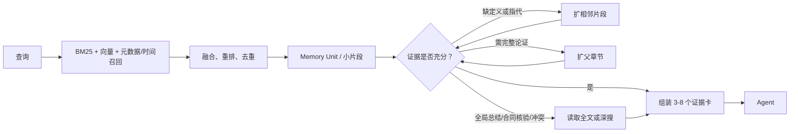

# Agent 记忆召回与 Personal OS 知识检索升级研究

> 日期：2026-07-19  
> 范围：Personal OS + Personal Wiki 的 Agent 记忆分类、局部召回、证据扩展、开源方案选型与落地路线  
> 结论属性：论文数字均为原作者在其数据集上的报告；“适合本项目”的判断是结合当前系统审计后的工程推断，必须用本地评测验证。

## 一、执行结论

最合适的方案不是在 Prompt 里要求 Agent 先读全文、再自行找出有用的 20%，也不是把现有系统整体替换成某个“Agent Memory 平台”。推荐保留 Personal OS 作为执行与状态控制面、Personal Wiki 作为可读且可追溯的原文库，在二者之间增加一个**系统侧记忆召回层**：

1. 原文保持不可变，任何摘要、事实和记忆卡都能回指到原文区间。
2. 索引时先按 Markdown 标题、段落、列表、代码块等语义边界切分，不再只按字符数硬切。
3. 为每个片段生成短小的“检索语境”，同时建立 BM25、向量和元数据索引。
4. 查询时先多路召回，再融合、重排和去重，只给 Agent 3～8 个高密度证据单元。
5. 系统判断证据是否足够；不足时才依次扩展到相邻片段、父章节、整篇文章或低频深搜。
6. 事实发生变化时不覆盖旧事实，而是标记有效期、替代关系和来源证据。
7. 摘要、实体抽取、关系构建和“睡眠整理”放在异步任务中，不占 Agent 的在线上下文。

这意味着原问题“Prompt 处理还是请求数据预处理”的答案是：

- **约 90% 放在系统调用与索引层完成**：切分、召回、扩展、排序、去重、预算、证据范围和时效判断。
- **Prompt 只保留很薄的协议**：优先使用返回证据；证据不足时调用扩展工具；不得把派生摘要当成不可质疑的原文。

## 二、当前系统审计快照

本轮对正在使用的 Personal OS / Wiki 检索链路做了只读核验。快照显示：

| 项目 | 当前状态 | 直接影响 |
| --- | --- | --- |
| 索引规模 | 4,359 个索引项：4,292 条 note + 67 条 atom；16,144 个 FTS chunk | 已经超过“全文直接塞进上下文”的适用范围 |
| 分块方式 | 文本折叠空白后，以约 900 字符、120 字符重叠固定切分 | 标题、表格、列表和完整论证容易被切断；代词片段缺少所属语境 |
| 首轮检索 | SQLite FTS5，查询词用 OR 组成候选 | 有关键词召回能力，但当前 chunk 查询未按 BM25 显式排序 |
| 返回内容 | 主要返回关键词附近 snippet | Agent 得到的是显示摘要，不是带标题路径、原文边界和邻接关系的完整证据块 |
| 二次排序 | Personal OS 主要按标题、concept、tag、excerpt 是否包含查询词加分 | 对同义表达、跨段关系、时效冲突和证据充分性判断较弱 |
| 召回策略 | 常规搜索没有 chunk → 邻块 → 章节 → 全文的渐进扩展 | 要么片段太薄，要么只能另行读取整篇，缺少中间层 |
| 元数据质量 | 4,260 条主 note 缺 `type`；3,320 个索引项只有通用标签；995 个缺 concepts / 明确概念边 | 依赖标签和概念的排序信号大面积失真 |
| 状态字段 | 4,291 / 4,292 条主 note 的状态是 `auto` | 无法可靠表达 current、superseded、disputed、archive 等生命周期 |
| 原始数据完整性 | 4,292 条主 note 的来源哈希均与源 JSON 一致 | 当前首要任务不是删除原文，而是建立派生层、分类层和检索质量层 |

现有 hot / warm / cold 更接近**一次召回后的上下文预算层级**，尚不能代替持久的知识类别、访问频率、时效状态和证据等级。这四个维度必须分开建模，不能继续挤在 tags 或一个 status 字段里。

## 三、前沿 Agent 如何召回记忆

### 3.1 共同架构：写入、管理、读取三条链

较成熟的 Agent Memory 系统都在把“记忆”从 Prompt 中拆出来：

- **Write**：保留 raw episode / source；异步提取事实、事件、偏好、SOP、摘要和实体关系。
- **Manage**：去重、合并、版本化、衰减、冲突检测、有效期和来源追踪。
- **Read**：按查询意图选择词法、语义、时间、关系或层级索引，然后在严格 token 预算内组装证据。

这比“向量库 + top-k”多了两个关键能力：**知道何时需要更大上下文**，以及**知道某条派生记忆能否追溯和是否仍然有效**。

### 3.2 与本项目最相关的技术

| 方法 | 原理 | 解决什么 | 对本项目的判断 |
| --- | --- | --- | --- |
| [Contextual Retrieval](https://www.anthropic.com/engineering/contextual-retrieval) | 索引前为每个 chunk 添加约 50～100 token 的文档内语境，再建立 BM25 与向量索引，并重排 | 片段离开原文后“它/该项目/上季度”失去指代 | **第一优先级**；直接修复当前固定 chunk 的语境丢失。Anthropic 报告其组合重排后将 top-20 检索失败率从 5.7% 降到 1.9%，但本项目必须重测 |
| [TierMem](https://arxiv.org/abs/2602.17913) | 先查快速摘要层；充分性路由器判断不足后，再访问不可变原始记录；验证后的发现回写并链接原文 | 用少量高密度内容回答多数问题，同时避免摘要遗漏关键限制 | **架构第一优先级**；与“只召回有用 20%”高度吻合。论文在 LoCoMo 上报告接近 raw-only 准确率，同时减少 54.1% 输入 token 和 60.7% 延迟 |
| [Small-to-big / Auto-merging](https://docs.haystack.deepset.ai/docs/automergingretriever) | 小块用于命中；同一父节点下命中块达到阈值时，返回父段或父章节 | 小块搜得准但回答信息不完整 | **必须自研进 API**；这是决定“片段还是全文”的直接机制，Haystack 已提供可验证的实现范式 |
| [Hindsight](https://github.com/vectorize-io/hindsight) | 语义、BM25、图和时间四路并行召回，经 RRF、cross-encoder 重排后按 token 上限裁剪 | 把复杂召回和上下文裁剪从 Agent 热路径拿走 | **最值得做 sidecar 对照实验**；MIT、可 Docker / embedded，自身 benchmark 结论仍需本地复测 |
| [Late Chunking](https://github.com/jina-ai/late-chunking) | 先让长上下文 embedding 模型编码整篇，再按块池化向量 | 保留跨块语义和代词指代 | **小规模实验**；依赖支持长输入且效果合适的 embedding 模型，官方示例仓库更新相对停滞 |
| [RAPTOR](https://arxiv.org/abs/2401.18059) | 对 chunk 递归聚类、摘要，形成多层树 | 跨章节问题和整篇理解 | **只用于长文/专题**；索引成本高，不应进入每次快速召回 |
| [Microsoft GraphRAG](https://github.com/microsoft/graphrag) | 抽实体关系和社区摘要，提供 local / global 查询 | “整个知识库有哪些主题/趋势/关联” | **低频全局分析通道**；不适合作为日常精确事实查询默认路径 |
| [HippoRAG](https://github.com/OSU-NLP-Group/HippoRAG) | 知识图谱结合 Personalized PageRank 做单步多跳检索 | 多文档关系链和关联问题 | **研究性 POC**；只在本地评测证明多跳查询占比和收益后引入 |
| [Graphiti](https://github.com/getzep/graphiti) | temporal context graph；事实有有效期，旧事实失效但不删除，全部回指 episode | 服务地址、项目决定、人员关系等随时间变化的事实 | **高优先级借鉴/隔离 POC**；不要把所有文章都图谱化，只处理实体、事实、事件和替代关系 |
| [LightMem](https://arxiv.org/abs/2510.18866) | 感觉过滤、短期话题整合、离线长期记忆更新 | 把整理成本移出在线请求 | **借鉴后台 consolidation 模式**，不必整套引入 |
| [A-MEM](https://arxiv.org/abs/2502.12110) | 类 Zettelkasten 的动态 note、关键词、链接和记忆演化 | 自动形成知识连接 | **借鉴自动链接，谨慎对待自动改写**；任何演化都须保留原文和审计记录 |
| [Mem0](https://github.com/mem0ai/mem0) | 事实抽取、实体链接、语义 + BM25 + entity 多信号融合 | 跨会话个人/Agent 事实记忆 | **适合抽取与检索 POC**；不建议替换现有 Wiki 和 Personal OS 控制面 |

### 3.3 关键词如何快速而准确地召回

关键词不应只做一次简单的全文 OR 搜索。系统可以在几十毫秒到几百毫秒的候选阶段完成以下处理，而不把过程交给 Agent：

1. **保留精确 token**：IP、端口、错误码、文件名、命令、产品名和中英文缩写不得被通用分词器破坏。
2. **查询规范化**：统一大小写、全半角、常见空格和标点，但同时保留原始查询用于 exact / phrase boost。
3. **受控别名展开**：从实体表扩展产品旧名、中文名、英文名、缩写和确认过的同义词；每次最多生成少量子查询，防止召回漂移。
4. **分字段 BM25**：title、heading、entity、verified keyword、body、contextual prefix 分开加权；标题和实体精确命中的权重高于正文偶然出现。
5. **向量补充语义**：处理“意思相同但没有同一个词”的情况，不替代 BM25。
6. **融合和精排**：用 RRF 合并多路结果，再让 reranker 判断“这个片段是否真的回答该问题”。
7. **邻接和父节点信息只作候选**：首轮命中后按充分性扩展，不把所有邻块都立即送给 Agent。
8. **增量索引与查询缓存**：新文档只重建受影响的 section / chunk；对稳定实体和高频查询缓存候选，不缓存过期事实的最终答案。

不同问题走不同召回配方：

| 查询意图 | 首选召回 | 何时扩展 |
| --- | --- | --- |
| 地址、端口、命令、报错码、专名 | exact / phrase BM25 + metadata | 命中块缺前置条件时扩父段 |
| 概念、原因、相似方案 | dense + BM25 + rerank | 多个相邻论点共同回答时扩章节 |
| “当前、之前、什么时候改的” | entity + temporal filter + lexical/dense | 新旧事实冲突时同时取版本和来源 |
| SOP / 怎么做 | procedural type + 标题/步骤结构 | 列表或代码被切断时取完整步骤单元 |
| 人物—项目—决定等多跳关系 | entity + graph + supporting chunks | 图边必须展开到原始证据 |
| 整篇总结、全库趋势 | hierarchy / global route | 只在该路由中使用高层摘要和跨文档综合 |

### 3.4 “全文还是关键词上下文”的系统判定

不要让 Agent 看到全文后再决定。检索服务应返回最小充分证据，并按以下顺序自动升级：



#### 默认只返回局部的条件

- 查询是具体事实、名称、地址、命令、决定、原因、定义或单个步骤。
- 一个或几个证据单元已覆盖问题实体、时间、谓词和限定条件。
- 命中块有明确标题路径，代词可以从短语境中消解。
- 多个来源没有出现高分冲突。

#### 扩相邻块或父章节的条件

- 命中以“因此、但是、如下、该方案、它”等承接词开头。
- 代码块、表格、步骤列表、引用或警告被边界截断。
- 查询要求“为什么、如何、前提是什么”，但片段只有结论。
- 高分证据来自同一章节的多个相邻块，合并后仍在预算内。

#### 读取全文或启动深搜的条件

- 用户明确要求整篇总结、完整审查、所有条件、跨章节对比。
- 法务、合同、安全、迁移等场景需要确认没有遗漏例外条款。
- 小片段之间互相冲突，需要回到原始上下文核验。
- 问题本身是 corpus-global，需要跨整篇或跨多文档综合。
- 文档本身很短，全文成本小于多次扩展成本。

“充分性”不能只由一个 LLM 自评。第一版可采用可解释规则：实体覆盖、查询词/同义词覆盖、标题匹配、分数间隔、来源数量、时间一致性、是否存在承接词、是否有冲突；对边界样本再调用小模型路由器。

## 四、建议的持久分类

知识的**语义类型**、**调用速度**、**生命周期**和**证据等级**是四个正交维度，应分别存储。

### 4.1 语义类型

| 类型 | 示例 | 默认召回方式 |
| --- | --- | --- |
| Policy / Identity | 安全边界、用户稳定偏好、系统地址约束 | 小量 pinned，任务相关时直接加载 |
| Procedural | 已验证 SOP、运行手册、故障处理步骤 | 精确词 + 语义检索，优先完整步骤单元 |
| Semantic Fact | 当前服务地址、项目结论、人物/系统属性 | 实体 + 时间 + 关键词/向量，返回当前版本 |
| Decision | 选择了什么、为什么、替代方案 | 按项目/主题/时间检索，结论与理由一起返回 |
| Episodic | 某次任务、故障、会议、Agent run 发生了什么 | 时间和实体过滤，默认只返回事件摘要，可展开证据 |
| Reference | 文章、论文、产品文档中的知识 | chunk / section 检索 |
| Raw Evidence | 原始网页、聊天、转写、JSON、附件 | 默认不进 Agent 上下文，只作为可展开证据 |

### 4.2 调用层级

- **Pinned**：极少、稳定、几乎每次都影响行为的规则；应有严格 token 上限。
- **Fast**：已验证事实、决定、SOP、活跃项目状态；优先查结构化 Memory Unit。
- **Standard**：普通笔记片段和历史事件；混合检索后按需返回。
- **Archive / Deep**：完整原文、长转写、旧运行记录；只有证据不足或全局问题才访问。

### 4.3 生命周期

`current`、`superseded`、`disputed`、`expired`、`archived`。任何替代都应记录 `supersedes_id`、`valid_from`、`valid_to` 和原始来源，不静默覆盖。

### 4.4 证据等级

`raw`（原文）、`verified`（人工或流程验证）、`derived`（模型抽取/摘要）、`inferred`（推断）。默认答复应优先 raw / verified；derived 必须能回溯到原文区间。

## 五、推荐的数据模型与 API

### 5.1 派生实体

在原 note/source 之外增加：

- `Document`：规范化来源、哈希、语言、创建/更新时间、访问范围。
- `Section`：`heading_path`、层级、原文字符范围、父子关系。
- `Chunk`：完整文本、邻接块、所属 section、token 数、检索语境、embedding 版本。
- `MemoryUnit`：50～250 token 的事实、决定、SOP 步骤或事件摘要；包含类型、实体、关键词、置信度和来源区间。
- `FactVersion`：主语、关系、宾语、有效期、替代关系、来源 episode。
- `RetrievalTrace`：查询、各路候选、融合分数、重排、扩展原因、最终 token、Agent 实际引用。

所有派生对象必须带：`source_document_id`、`source_hash`、`char_start`、`char_end` 或可重建的块 ID。原文变化后应使旧派生对象失效并重建，而不是保留“幽灵摘要”。

### 5.2 面向 Agent 的返回契约

```json
{
  "query": "当前 Personal OS 默认地址是什么？",
  "sufficiency": {
    "status": "sufficient",
    "coverage": 0.93,
    "conflicts": []
  },
  "items": [
    {
      "kind": "verified_fact",
      "text": "Personal OS 唯一默认地址为……",
      "source": {
        "documentId": "...",
        "headingPath": ["服务边界"],
        "charStart": 120,
        "charEnd": 168,
        "sourceHash": "..."
      },
      "score": 0.94,
      "validity": "current",
      "expand": {
        "neighbor": "...",
        "section": "...",
        "document": "..."
      }
    }
  ],
  "budget": {
    "usedTokens": 186,
    "limitTokens": 1800
  }
}
```

Agent 不需要理解 BM25、向量库、图算法或 chunk 规则；它只需要消费排序后的证据卡，并在 `sufficiency != sufficient` 时调用一次扩展接口。

## 六、GitHub 项目版图

活跃度为 2026-07-19 的仓库快照；星标只表示生态关注度，不等于检索质量。许可证以仓库当前元数据为准，引入前仍需由工程流程复核具体版本和依赖许可证。

| 项目 | 定位 / 可借鉴能力 | 许可证 | 当前判断 |
| --- | --- | --- | --- |
| [vectorize-io/hindsight](https://github.com/vectorize-io/hindsight) | 专门的 Agent Memory sidecar；语义、BM25、图、时间召回，RRF + cross-encoder + token 裁剪 | MIT | **第一批 POC**：最接近目标 EvidencePack 管线，可作为原生实现的对照组 |
| [mem0ai/mem0](https://github.com/mem0ai/mem0) | Agent 长期记忆、事实抽取、实体链接、多信号召回 | Apache-2.0 | **POC**：试抽取与融合；不替换 Wiki |
| [getzep/graphiti](https://github.com/getzep/graphiti) | 双时间事实图、episode provenance、语义 + BM25 + graph | Apache-2.0 | **高优先 POC**：只选动态事实域 |
| [letta-ai/letta-code](https://github.com/letta-ai/letta-code) | Stateful agent、memory blocks、git-backed MemFS、memory subagent | Apache-2.0 | **架构参考**：整套 agent harness 与 Personal OS 重叠较大；旧 `letta` V1 server 仓库已被官方标为 legacy |
| [langchain-ai/langgraph](https://github.com/langchain-ai/langgraph) | thread 短期状态、跨会话 store、后台写入模式 | MIT | **接口参考**：不是完整知识检索引擎 |
| [langchain-ai/langmem](https://github.com/langchain-ai/langmem) | hot-path 记忆工具和后台抽取、合并、更新 | MIT | **consolidation 参考**：适合借后台管理器契约，不必绑定 LangGraph |
| [topoteretes/cognee](https://github.com/topoteretes/cognee) | 向量 + 图记忆、remember / recall / forget、self-host | Apache-2.0 | **候选 POC**：与 Graphiti 二选一先测 |
| [HKUDS/LightRAG](https://github.com/HKUDS/LightRAG) | 轻量图 RAG、REST 服务、多存储后端 | MIT | **专题实验**：长文/关系查询，不进默认快速路径 |
| [OSU-NLP-Group/HippoRAG](https://github.com/OSU-NLP-Group/HippoRAG) | KG + Personalized PageRank 的多跳检索 | MIT | **研究观察/POC**：仅多跳评测通过后采用 |
| [microsoft/graphrag](https://github.com/microsoft/graphrag) | 实体关系、社区摘要、local/global query | MIT | **低频全局通道**：成本高，不作日常记忆层 |
| [parthsarthi03/raptor](https://github.com/parthsarthi03/raptor) | 递归聚类与树状摘要检索 | MIT | **借方法**：官方代码最后推送较早，避免直接成为核心依赖 |
| [jina-ai/late-chunking](https://github.com/jina-ai/late-chunking) | 全文编码后进行 chunk pooling | Apache-2.0 | **embedding 实验**：仓库更新较早，先离线对比 |
| [agiresearch/A-mem](https://github.com/agiresearch/A-mem) | Zettelkasten 风格 note、链接和记忆演化 | MIT | **借自动链接**：禁止无审计地自动改写已验证记忆 |
| [FreedomIntelligence/Tiermem](https://github.com/FreedomIntelligence/Tiermem) | 摘要优先、充分性路由、原文升级和 provenance | MIT | **核心设计参考**：项目较新、生态很小，不直接押注其代码 |
| [zjunlp/LightMem](https://github.com/zjunlp/LightMem) | 在线过滤、话题整合、离线长期 consolidation | MIT | **后台整理参考** |
| [run-llama/llama_index](https://github.com/run-llama/llama_index) | sentence window、recursive / auto-merging retriever 等组件 | MIT | **组件与实现参考**：可抄契约，不必引入整套框架 |
| [deepset-ai/haystack](https://github.com/deepset-ai/haystack) | 显式检索/路由/重排 pipeline | Apache-2.0 | **工程参考**：适合评估可组合 pipeline |
| [SciPhi-AI/R2R](https://github.com/SciPhi-AI/R2R) | 自托管检索服务、知识图和 Agentic RAG API | MIT | **服务参考**：与现有 API 面重叠，近期活跃度弱于头部项目 |
| [neuml/txtai](https://github.com/neuml/txtai) | 嵌入式语义搜索、图和工作流 | Apache-2.0 | **轻量备选**：若希望单进程快速补向量能力可测 |
| [infiniflow/ragflow](https://github.com/infiniflow/ragflow) | 文档解析、RAG 服务、管理 UI、Agent 能力 | Apache-2.0 | **解析/UI 参考**：整体较重，不建议并入 Personal OS 核心 |
| [stanford-futuredata/ColBERT](https://github.com/stanford-futuredata/ColBERT) | token 级 late interaction 检索 | MIT | **前沿检索观察**：质量潜力高，但索引和运维复杂度高于当前需要 |
| [xiaowu0162/LongMemEval-V2](https://github.com/xiaowu0162/LongMemEval-V2) | 静态状态、动态变化、工作流、环境陷阱和前提意识评测 | Apache-2.0 | **必须借鉴评测维度**，不作为运行时依赖 |

维护活跃度上，Hindsight、Graphiti、Mem0、Letta Code、LangGraph / LangMem、Cognee、LightRAG、HippoRAG、GraphRAG、LightMem、Haystack、LlamaIndex、txtai 和 RAGFlow 在 2026 年 7 月仍有代码推送或 release。RAPTOR 和 late-chunking 的官方示例仓库分别自 2024 年 9 月和 12 月后没有新 push；它们仍有方法价值，但不宜成为缺少维护兜底的核心依赖。R2R 的最近代码推送停在 2025 年 11 月；TierMem 的代码很新但生态仍小。

### 推荐短名单

1. **立即吸收方法**：Contextual Retrieval、TierMem、small-to-big、LongMemEval-V2。
2. **第一轮 sidecar 对照**：Hindsight；验证它相对当前 FTS 和我们原生管线的准确率、token 与延迟。
3. **第一轮记忆 POC**：Graphiti 的时间/来源模型；Mem0 的事实抽取与多信号融合。
4. **第二轮专题 POC**：LightRAG 或 HippoRAG，只选一个测试多跳；不要同时铺开。
5. **长文层级通道**：借 RAPTOR 思路自建轻量树，或先用 Haystack / LlamaIndex auto-merging 验证。
6. **只作架构参考**：Letta Code、LangGraph / LangMem、RAGFlow；不迁移现有控制面。

### 第一轮 POC 如何安排

| 轨道 | 目的 | 数据范围 | 通过条件 |
| --- | --- | --- | --- |
| Current baseline | 保存现有 FTS 的真实基线 | 全部黄金问题 | 可重复得到当前 Recall、token、延迟和错误类型 |
| Native Retrieval v2 | 结构化 chunk、BM25、邻接/父级扩展 | 全量索引的影子副本 | 不增加外部运行时即可显著提升片段精度，并能解释每次扩展 |
| Hindsight sidecar | 验证四路召回、RRF、重排与 token 裁剪的上限 | 先取 200～500 篇代表性文档 | 相比 Native v2 有可重复的质量增益，且延迟、成本和 provenance 可接受 |
| Graphiti temporal | 验证 current / superseded / disputed 与多跳时间查询 | 仅服务地址、项目决定、责任关系 | 能稳定选中当前事实、回溯旧事实，并给出原始 episode |
| Mem0 extractor | 验证事实抽取、实体链接和多信号召回 | 同一小样本，不接管正式写入 | 抽取精确率达标，且所有结果能落到原文区间；DELETE 语义改为 invalidate / supersede |

各 POC 都通过相同 `MemoryBackend` 适配器接收 `insert(document)`、`query(query, filters, budget)`、`expand(handle, level)`，并返回统一 EvidencePack。这样可以替换实验后端而不改 Agent 和 Personal OS 上层接口。

## 七、合并到 Personal OS / Wiki 的阶段方案

### Phase 0：先建立可重复评测（1 个小迭代）

建立 80～120 条本地黄金问题，每条记录期望文档、期望原文区间、答案要点和是否应扩展。覆盖：

- 精确标识符、中文同义表达、概念查询；
- 单段事实、跨相邻段、跨章节、多文档；
- 当前事实与被替代事实；
- SOP、项目决定、历史事件；
- 应拒答 / 无证据；
- 整篇总结和全库主题分析。

指标至少包括 `Recall@5`、MRR / nDCG、context precision、证据区间命中率、答案正确率、过时事实率、矛盾发现率、拒答准确率、输入 token、P50/P95 延迟。没有这一步，任何“项目榜单”和论文百分比都无法指导生产选择。

### Phase 1：修复当前 FTS 与分块，不引入新基础设施

1. Markdown 结构化分块：标题路径、段落、列表、表格、代码块不可随意截断。
2. 保存 chunk 全文、字符范围、父 section、前后邻块和 token 数。
3. FTS 查询显式使用 BM25 排序；候选按文档去重并保留最佳块。
4. 新增 `/api/search/chunks/:id/expand?level=neighbor|section|document`。
5. Context pack 只返回真实证据块，不再把短 snippet 当成证据正文。
6. 增加检索 trace 和 token 预算日志。

这是风险最低、最可能立即改善结果的一期。

### Phase 2：混合召回与严格重排

1. 为 chunk 建 embedding；保留 FTS 处理地址、报错码、命令和专有名词。
2. 用 Reciprocal Rank Fusion 合并 BM25、向量和元数据候选。
3. 对 top 30～50 做 cross-encoder / reranker，再选 3～8 个证据单元。
4. 对每篇文档限制最大块数，使用多样性约束避免 8 个结果来自同一处。
5. 离线生成 50～100 token contextual prefix，只用于索引；返回 Agent 时区分“派生语境”和“原文”。

### Phase 3：高密度 Memory Unit 与后台 consolidation

1. 从新输入异步抽取 Fact、Decision、SOP、Episode summary。
2. 抽取结果先处于 `derived`，满足规则或人工/任务验证后才升级为 `verified`。
3. Memory Unit 必须链接原始区间；来源变化后自动失效。
4. 新事实与旧事实冲突时创建版本和替代关系，不覆盖原记录。
5. 高频验证结果可以回写成新的快速记忆单元，形成 TierMem 式“越用越快”。

### Phase 4：动态事实图的隔离 POC

只选择三个变化频繁且价值高的域：服务地址/运行状态、项目决定、人员或 Agent 责任关系。比较：

- 在现有 Postgres 中自建最小 `FactVersion + Entity + Evidence`；
- 独立部署 Graphiti，Personal OS 只通过适配器访问。

达到时间问答、过时事实拒用、来源回溯和延迟目标后再扩大；普通文章、长转写和原始网页仍留在 Wiki，不强制进图。

### Phase 5：低频深搜与全局知识分析

对确实需要跨章节或全库综合的问题，增加独立 `deep_research` 路由，可使用 RAPTOR / LightRAG / GraphRAG 类索引。该路由有更高延迟和 token 预算，绝不混入默认 Agent 快速调用。

## 八、验收门槛

建议在生产切换前设置以下门槛，具体数值可在基线跑完后微调：

- 具体事实类问题 `Recall@5 >= 0.90`；
- 最终 context precision 较当前提升至少 30%；
- 80% 以上普通问题不读取全文；
- P50 返回证据正文不超过 1,500 token，P95 不超过 4,000 token；
- 被替代事实误答率低于 2%，且答案能显示当前来源；
- 每个派生 Memory Unit 的原文回溯成功率为 100%；
- 无证据问题的拒答准确率达到预设基线；
- 任一新方案如果只提高答案分数但显著增加 token / P95 延迟，不进入默认通道。

## 九、不建议做的事情

- 不要靠增加一个长 Prompt 解决检索质量；Prompt 不能修复索引时已经丢失的上下文。
- 不要把所有原文先摘要后丢弃；未来问题未知，写入时摘要天然可能漏掉关键限制。
- 不要一上来把 4,000 多篇内容全部送入知识图谱；图谱只服务关系、时间和多跳问题。
- 不要只用向量检索；服务地址、代码符号、错误码和人名更依赖词法精确匹配。
- 不要直接采用论文报告的百分比作为上线依据；语料、embedding、reranker 和 query 分布都会改变结果。
- 不要把 `hot/warm/cold`、知识类型、当前/过时状态和证据等级混成一套标签。
- 不要在清理阶段做大规模删除；当前原始来源完整，应先标记、隔离、派生和评测。

## 十、持续关注的前沿阵地

- 工程方法：[Anthropic Engineering](https://www.anthropic.com/engineering)、[Jina AI Research](https://jina.ai/news/)、[Microsoft Research GraphRAG](https://www.microsoft.com/en-us/research/project/graphrag/)。
- Agent memory 实现：Mem0、Graphiti、Letta、Cognee、LightMem 的 release / paper / issue。
- 检索组件：LlamaIndex、Haystack、ColBERT、LightRAG、HippoRAG。
- 基准：[LongMemEval](https://github.com/xiaowu0162/longmemeval)、[LongMemEval-V2](https://github.com/xiaowu0162/LongMemEval-V2)、[Mem0 memory-benchmarks](https://github.com/mem0ai/memory-benchmarks)。
- 论文关键词：`agent memory consolidation`、`provenance-aware memory`、`temporal knowledge graph agent`、`hierarchical retrieval`、`context compression retrieval`、`memory contradiction resolution`。

建议建立一个月度 radar，只记录：新方法解决的失败类型、是否有开源代码、许可证、最近 release、可复现实验、在本地黄金集上的增益和运维代价。未通过本地评测的项目只留在观察区，不进入生产架构。

## 十一、研究来源

- [Anthropic — Introducing Contextual Retrieval](https://www.anthropic.com/engineering/contextual-retrieval)
- [Hindsight official repository](https://github.com/vectorize-io/hindsight)
- [Haystack AutoMergingRetriever](https://docs.haystack.deepset.ai/docs/automergingretriever)
- [TierMem paper](https://arxiv.org/abs/2602.17913) / [official code](https://github.com/FreedomIntelligence/Tiermem)
- [Mem0 paper](https://arxiv.org/abs/2504.19413) / [official repository](https://github.com/mem0ai/mem0)
- [Graphiti official repository](https://github.com/getzep/graphiti)
- [RAPTOR paper](https://arxiv.org/abs/2401.18059) / [official repository](https://github.com/parthsarthi03/raptor)
- [HippoRAG paper](https://arxiv.org/abs/2405.14831) / [official repository](https://github.com/OSU-NLP-Group/HippoRAG)
- [Microsoft GraphRAG official repository](https://github.com/microsoft/graphrag)
- [A-MEM paper](https://arxiv.org/abs/2502.12110) / [system repository](https://github.com/agiresearch/A-mem)
- [LightMem paper](https://arxiv.org/abs/2510.18866) / [official repository](https://github.com/zjunlp/LightMem)
- [LongMemEval paper](https://arxiv.org/abs/2410.10813) / [official repository](https://github.com/xiaowu0162/longmemeval)
- [LongMemEval-V2 paper](https://arxiv.org/abs/2605.12493) / [official repository](https://github.com/xiaowu0162/LongMemEval-V2)
- [LangGraph memory concepts](https://docs.langchain.com/oss/python/concepts/memory)
- [OpenAI Agents SDK sessions](https://openai.github.io/openai-agents-python/sessions/) / [sandbox agent memory](https://openai.github.io/openai-agents-python/sandbox/memory/)
- [AWS AgentCore long-term memory](https://docs.aws.amazon.com/bedrock-agentcore/latest/devguide/long-term-memory-long-term.html)
